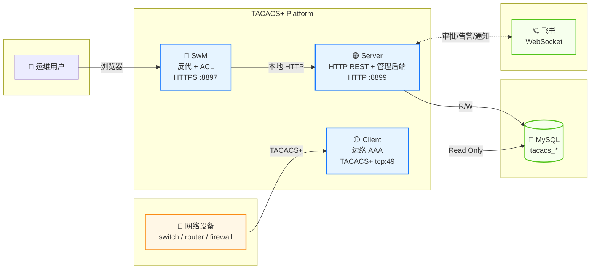
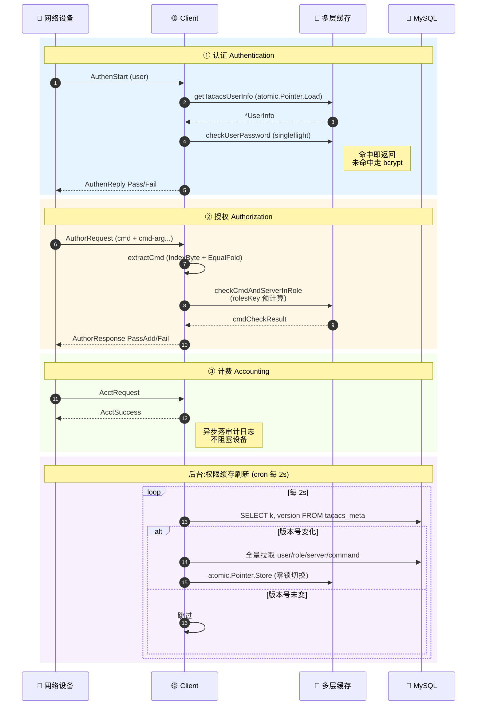
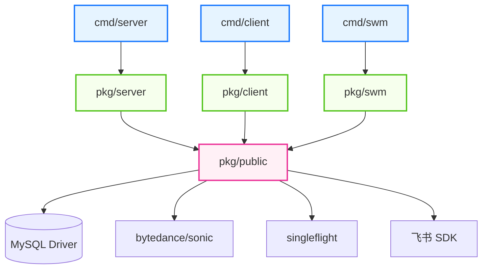
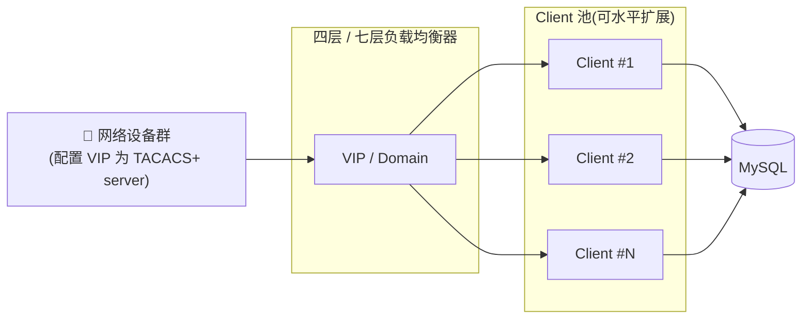
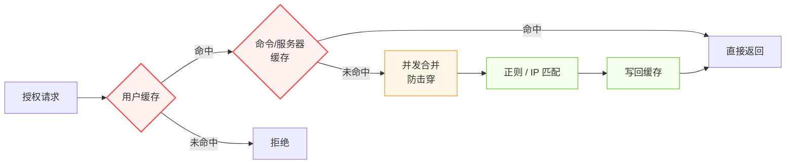

span

# TACACS+ Authentication System

**企业级 TACACS+ 网络设备鉴权与权限管理一体化平台**

*Enterprise-grade TACACS+ AAA platform with built-in management portal & ACL*

[](https://go.dev/)
[](https://datatracker.ietf.org/doc/rfc8907/)
[](https://www.mysql.com/)
[](#-构建)
[](#-license)

</div>

---

## 📑 目录

- [✨ 核心特性](#-核心特性)
- [🌐 网络与运维原生能力](#-网络与运维原生能力)
- [🏗️ 系统架构](#️-系统架构)
- [🔄 协议流程](#-协议流程)
- [⚠️ 部署前安全须知](#️-部署前安全须知)
- [🚀 快速开始](#-快速开始)
  - [① 环境准备](#-环境准备-prerequisites)
  - [② 数据库](#-数据库)
  - [③ 配置文件](#-配置文件)
  - [④ 构建](#-构建)
  - [⑤ 启动服务](#-启动服务)
  - [⑥ 初始化第一个管理员](#-初始化第一个管理员)
- [🔐 管理员账号变更](#-管理员账号变更)
- [🛟 值班白名单管控](#-值班白名单管控)
- [📦 目录结构](#-目录结构)
- [⚖️ 负载均衡](#️-负载均衡)
- [⚡ 性能与缓存设计](#-性能与缓存设计)
- [📝 日志收集与归档](#-日志收集与归档)
- [🔌 端口与协议](#-端口与协议)
- [🛠️ 命令速查](#️-命令速查)
- [📜 License](#-license)

---

## ✨ 核心特性


| 维度                      | 能力                                                                                                                                          |
| ------------------------- | --------------------------------------------------------------------------------------------------------------------------------------------- |
| 🔐**协议合规**            | 完整实现 TACACS+ (RFC 8907) Authentication / Authorization / Accounting                                                                       |
| 🌐**一体化前端**          | SwM 反向代理 + ACL 鉴权层,统一入口 HTTPS :8897                                                                                                |
| ⚡**高性能缓存**          | 用户/密码/命令三层缓存,授权热路径毫秒级响应                                                                                                   |
| 🔄**2 秒级权限同步**      | 数据库触发器驱动版本号,权限变更最慢 2 秒生效                                                                                                  |
| 🛡️**密码安全**          | bcrypt 哈希存储,密码字段永不明文外泄                                                                                                          |
| 📡**DSCP 全链路打标**     | TACACS+ 报文在监听器/拨号器 socket 选项层就设置 IP_TOS / IPV6_TCLASS,**三次握手包起**就携带 DSCP,无损网络场景下认证/授权报文走 EF/AF 队列免丢 |
| 🚀**TCP 链路调优**        | 边缘 Client`SetNoDelay` 关 Nagle、`SetKeepAlive` + 30s 探活,降低首包延迟、防 NAT 老化导致的"幽灵连接"                                         |
| 🔁**Single-Connect 复用** | 完整支持 RFC 8907 Single Connection Mode,一条 TCP 复用 N 个 AAA 会话,节省网络设备侧握手成本                                                   |
| 🪪**PROXY protocol**(可选)| 跨四层 LB(HAProxy/DPVS/Nginx Stream/K8s NodePort)透传真实交换机 IP,可信源 CIDR 白名单防 IP 伪造,留空即不启用                              |
| 🚧**多层防滥用闸门**      | Server 1MB body 上限、Client`/health` 全局 2 QPS 令牌桶、登录 5 次/15 分钟自动锁定、IP CIDR 白名单四道闸,默认开箱即安全                       |
| 🌐**浏览器侧硬化**        | CSP/HSTS/X-Frame-Options/Permissions-Policy 等 7 项安全响应头,CSRF 双提交 + 恒时比较防时序攻击                                                |
| 🚨**进程崩溃飞书加急**    | `defer recover` 捕获 panic 后向 `manager` 发送红色加急卡片,值班人员秒级感知                                                                   |
| 📊**飞书集成**(可选)      | 卡片消息 + 应用内/短信/电话加急,审批/告警/通知一站式;不接入也能在 SwM 前端走完整审批流                                                        |
| 🧰**运维友好**            | 命令模板 / 角色模板 / 服务器模板 / 值班白名单全部 Web 化管理                                                                                  |
| 🔧**水平扩展**            | Client 边缘节点无状态,四层/七层 LB 即可扩容                                                                                                   |

---

## 🌐 网络与运维原生能力

除"业务逻辑"以外,平台在网络栈和运维体感上做了一批专门优化,大多是"装好就生效、不需要额外配置"的原生能力。

### 📡 DSCP 全链路打标(无损网络必备)

TACACS+ 通常和生产网管面共用链路,一旦设备/链路抖动出现拥塞,认证报文被丢就意味着运维和业务全部失联。DSCP 打标可以让 AAA 报文在交换机的 QoS 队列里享有 EF/AF 优先级,显著降低拥塞时的丢包率。

**这里和其他实现的关键差异**:


|                  | 仅`setsockopt(IP_TOS)` 在已建立的连接上 | 本项目                                                             |
| ---------------- | --------------------------------------- | ------------------------------------------------------------------ |
| SYN/ACK 三次握手 | **不带 DSCP**(socket 还没建好)          | **带 DSCP**(在 `ListenConfig.Control` / `Dialer.Control` 里就预置) |
| RST/FIN 拆链     | 取决于 socket 是否回收                  | 一致带 DSCP                                                        |
| IPv6 双栈        | 多数实现仅打 IPv4                       | IPv4 走`IP_TOS`、IPv6 走 `IPV6_TCLASS`,自动判别                    |

配置只需在 `cfg_client.yaml` 填一个 0~63 的值即可,留空或 `"0"` 表示不打标:

```yaml
tacPlus:
  ip: "0.0.0.0"
  port: "49"
  shareKey: "your-tacacs-shared-key"
  dscp: "46"     # EF (Expedited Forwarding),适合关键控制面流量
```

### 🚀 TCP 链路调优

边缘 Client 接受到的每一条 TACACS+ TCP 连接,都会立即设置:

- `SetNoDelay(true)` — 关闭 Nagle 算法,小包(认证请求平均几十字节)立刻发送,不再凑 MSS。**首包延迟降低一个 RTT**。
- `SetKeepAlive(true) + SetKeepAlivePeriod(30s)` — 网络设备到 Client 的长连接经过 NAT/防火墙时,30 秒一次的 keepalive 探活能避免会话表老化导致的"半开/幽灵连接"。

### 🔁 Single-Connect 多路复用

完整支持 RFC 8907 §4.5.1 Single Connection Mode。开启后一台网络设备的多次 AAA 会话(同一用户多条命令、不同用户的认证 + 授权 + 计费)可以**复用同一条 TCP**,显著减少 TCP 握手开销。日志里 `isSingleConnect: true` 字段直接体现。

### 🪪 PROXY protocol —— 跨 LB 透传真实交换机 IP(可选)

四层 LB(HAProxy / DPVS FullNAT / Nginx Stream / K8s NodePort)做 SNAT 之后,Client 内核拿到的 `RemoteAddr()` 是 **LB 出口 IP**,不是交换机真实 IP;审计/限速/排障会全部把流量算在少数几个 LB 节点头上。开启 PROXY protocol 后,LB 在 TCP 握手之后、TACACS+ 首字节之前先发一段头(v1 文本 / v2 二进制),Client 端识别这段头并把 `RemoteAddr()` 替换回原始客户端 IP,业务代码无感知。

**安全底线**:PROXY 头未签名,任何能 TCP 连上 49 端口的对端都可以伪造。因此**必须**配 `proxyTrustedCidrs` 白名单,只接受来自 LB 自身 IP 段的 PROXY 头,其它源即使发了也丢弃。完整字段说明、行为矩阵、各 LB 的 `send-proxy` 配法见下文「⚖️ 负载均衡 → 🪪 PROXY protocol」章节。

留空 `proxyTrustedCidrs` = 不启用 PROXY 解析,`RemoteAddr()` 始终取 TCP 对端;交换机不走 LB 直连本机也照常工作(USE/IGNORE 双策略并存)。

### 🚧 多层防滥用闸门

每一层都是"装好就生效",无需额外配置:


| 层                   | 限制                                                                   | 触发后行为                        |
| -------------------- | ---------------------------------------------------------------------- | --------------------------------- |
| **Server HTTP**      | `body ≤ 1MB`(MaxBytesReader)                                          | 413 + 「拆成多次/用模板」可读提示 |
| **Client HTTP**      | `/health` 全局 2 QPS 令牌桶                                            | 429 + 限速原因                    |
| **SwM `/login`**     | 单 IP 5 次/分钟,失败 5 次锁 15 分钟                                    | 429 + 锁定提示 + 审计日志         |
| **Server IP 白名单** | 默认仅放行`127.0.0.1/32`+`::1/128`,跨机部署填 `swm_auth.allowed_cidrs` | 403 + 审计日志,签名校验之前先拒   |

### 🌐 浏览器侧硬化

SwM 默认下发 7 项标准安全响应头:`Content-Security-Policy`(同源 default-src 'self')、`Strict-Transport-Security`(HSTS 1 年)、`X-Content-Type-Options: nosniff`、`X-Frame-Options: DENY`、`Referrer-Policy: same-origin`、`Permissions-Policy`(关闭地理/相机/麦克风/支付)、`Cross-Origin-Opener-Policy: same-origin`。CSRF 采用 session 绑定的 token + `subtle.ConstantTimeCompare`,防时序攻击。

### 🚨 进程崩溃飞书加急

Server / Client / SwM 三个进程的 `main()` 都用 `defer recover()` 兜底,捕获到 panic 后:

1. 把堆栈写进 `*_app.log`
2. 向 `cfg.manager`(飞书用户 ID)发送**红色加急卡片**(应用内 + 短信 + 电话三连)
3. 进程退出后由 `deploy.sh` 或 systemd/k8s 拉起

留空 `manager` 字段即关闭告警,日志依然落盘。

---

## 🏗️ 系统架构



**三个二进制各司其职**:

- **SwM** — 浏览器入口、HTTPS 卸载、CSRF/ACL 中间件、签名校验,后端只暴露给 SwM 这一条链路。
- **Server** — 业务逻辑与持久化,所有用户/角色/命令/服务器模板/审批/值班的 CRUD 都在这里;同时也是飞书消息发出方。
- **Client** — 部署在每个边缘节点,直接和网络设备的 TACACS+ 客户端对话,只读 DB,本地维护多层缓存。

---

## 🔄 协议流程



---

## ⚠️ 部署前安全须知

> 在拉起服务之前**务必**阅读本节。本节描述的部署前提是系统安全模型的基石,不满足会直接导致**未授权访问**。

**🔒 安全边界设计**

本平台的访问控制模型是分层的:

- **SwM(8897)** — 唯一的浏览器入口,负责身份认证、CSRF、签名生成,所有管理员/普通用户 ACL **全部在此完成**
- **Server(8899)** — 业务后端,通过 HMAC 签名校验请求来自持有 `swm_auth.shared_secret` 的调用方。签名 base 已经把 `X-SwM-User` / `X-SwM-Is-Admin` 头纳入计算,因此**第三方无法在网络中篡改这两个头**;但后端**不验证"是谁把这两个头填上去的"** —— 持密钥的调用方(= SwM 本体)可以为任意 user / isAdmin 组合算出合法签名

这意味着:**任何能直接访问 8899 的客户端,只要持有 `swm_auth.shared_secret`,就可以伪造任意身份调用任意接口,包括管理员独占接口。**

**🛡️ 强制部署约束**


| # | 约束                                                                                                                                                                                                                                                                                                                                                                        | 不满足的后果                                                                    |
| -: | --------------------------------------------------------------------------------------------------------------------------------------------------------------------------------------------------------------------------------------------------------------------------------------------------------------------------------------------------------------------------- | ------------------------------------------------------------------------------- |
| 1 | **Server 监听地址必须是 `127.0.0.1:8899` 或仅对 SwM 主机开放的内网 IP**,**严禁**暴露到公网或办公网                                                                                                                                                                                                                                                                          | 任何持密钥者可越权操作                                                          |
| 2 | **`swm_auth.shared_secret` 必须使用强随机值**(建议 `openssl rand -base64 48`),且 SwM 与 Server 严格一致                                                                                                                                                                                                                                                                     | 弱密钥可被爆破,等价于 #1 失守                                                   |
| 3 | **`swm_auth.enforce: true` 生产环境必须开启**                                                                                                                                                                                                                                                                                                                               | 关闭后任何匿名请求都能直达 Server                                               |
| 4 | **生产环境必须走 HTTPS**:要么填 `cfg_swm.yaml` 的 `cert_file` / `key_file` 让 swm 自跑 HTTPS,要么在前面挂 nginx/ALB 反代终结 TLS(反代场景下两个字段可留空,swm 降级明文 HTTP)。HTTP 模式仅在 **本机用 `http://localhost` / `127.0.0.1` 直连开发**时勉强能用(浏览器把回环视为 secure context),**任何用 LAN IP / 域名访问 HTTP 的场景都会因 Secure cookie 不被接受而登录失败** | 中间人可截获 session cookie;且非回环 HTTP 访问下 cookie 被浏览器丢弃,登录走不通 |
| 5 | **数据库账号严格区分读写**:Client 用只读账号,Server 用读写账号                                                                                                                                                                                                                                                                                                              | 边缘节点失陷可改库                                                              |
| 6 | **跨机部署务必显式设置 `swm_auth.allowed_cidrs`**(默认仅放行 `127.0.0.1/32` + `::1/128`)                                                                                                                                                                                                                                                                                    | 配错=同机白名单挡掉所有真实请求;不配=对外暴露时 #1 防线裸奔                     |

> **关于 #6 的兜底机制**:Server 在签名校验之前先按源 IP 兜底拒绝。默认配置(`allowed_cidrs` 留空)只放行本机回环,适合「SwM 与 Server 同机部署」的开箱即用场景。跨机部署需在 `cfg_server.yaml` 的 `swm_auth.allowed_cidrs` 显式列出 SwM 主机的 IP 或网段(CIDR 格式,单 IP 必须带 `/32` 或 `/128` 后缀)。

**🚪 推荐网络拓扑**

```
公网 / 办公网
     │
     ▼
   ┌─────────────┐
   │ SwM :8897   │  (HTTPS, 公开)
   └──────┬──────┘
          │ 127.0.0.1 / 内网 only
          ▼
   ┌─────────────┐
   │ Server:8899 │  (HTTP, 内网封闭)
   └──────┬──────┘
          ▼
       MySQL
```

> 同主机部署最简单:Server 与 SwM 装一台机器,Server 配 `http: "127.0.0.1:8899"` 即可。此场景下 `swm_auth.allowed_cidrs` 留空也安全 —— Server 自带的 IP 白名单默认仅放行 loopback,等价于对外彻底封闭。

---

## 🚀 快速开始

### ① 环境准备 *Prerequisites*


| 依赖      | 版本要求                    | 说明                                                     |
| --------- | --------------------------- | -------------------------------------------------------- |
| **Go**    | `>= 1.26`                   | 编译 server/client/swm 三个二进制                        |
| **MySQL** | `>= 5.7` 或 `8.0`           | InnoDB 引擎 (用于触发器 + 行锁)                          |
| **OS**    | Linux / macOS               | 支持 amd64、arm64 架构                                   |
| **网络**  | TCP 49 / 8383 / 8897 / 8899 | 分别对应 TACACS+ / Client HTTP / SwM HTTP(或 HTTPS,取决于是否填了 TLS 证书) / Server HTTP |

**环境变量**


| 变量      | 说明                                                 | 默认值 |
| --------- | ---------------------------------------------------- | ------ |
| `APP_ENV` | 运行环境,设为`prod` 则连接生产 DB 和 Apollo 生产集群 | `test` |

使用 `deploy.sh` 启动时直接传入即可：

```bash
# 测试环境(默认)
./scripts/deploy.sh start server

# 生产环境
APP_ENV=prod ./scripts/deploy.sh start server
```

手动启动时需自行设置：

```bash
# Linux / macOS (bash / zsh)
export APP_ENV=prod
./build/<os>_<arch>/server -c cfg.yaml

# 或单次生效
APP_ENV=prod ./build/<os>_<arch>/server -c cfg.yaml
```

### ② 数据库

> 默认使用 MySQL,其他 RDBMS 暂未适配。

**Step 2.1 — 创建库**

```bash
mysql -u <user> -p
```

```sql
CREATE DATABASE IF NOT EXISTS <db_name>
    DEFAULT CHARSET = utf8mb4
    COLLATE = utf8mb4_unicode_ci;
```

请把 **用户名 / 密码 / 库名** 记录下来,后面写进配置文件。

**Step 2.2 — 业务表**

```bash
DB=<db_name>
USER=<user>

mysql -u $USER -p $DB < static/sql/tacacs_admin.sql
mysql -u $USER -p $DB < static/sql/tacacs_approval.sql
mysql -u $USER -p $DB < static/sql/tacacs_command_template.sql
mysql -u $USER -p $DB < static/sql/tacacs_role_template.sql
mysql -u $USER -p $DB < static/sql/tacacs_server_template.sql
mysql -u $USER -p $DB < static/sql/tacacs_user.sql
mysql -u $USER -p $DB < static/sql/tacacs_on_duty.sql
mysql -u $USER -p $DB < static/sql/tacacs_on_duty_white_list.sql
```

每个表的语义:


| 表                          | 作用                             |
| --------------------------- | -------------------------------- |
| `tacacs_admin`              | 平台管理员账号                   |
| `tacacs_user`               | 受 TACACS+ 鉴权的最终用户        |
| `tacacs_role_template`      | 角色模板:命令集 + 服务器集的组合 |
| `tacacs_command_template`   | 可执行命令的正则集合             |
| `tacacs_server_template`    | 可登录服务器(IP / CIDR)集合      |
| `tacacs_approval`           | 临时权限申请与审批工单           |
| `tacacs_on_duty`            | 值班人员(免角色检查)             |
| `tacacs_on_duty_white_list` | 值班权限白名单                   |

**Step 2.3 — 缓存版本号触发器**

```bash
mysql -u $USER -p $DB < static/sql/tacacs_meta.sql
```

> 💡 **为什么需要这一步?**
> Client 每 2 秒轮询一次,判断"权限数据是否有变更",依据是 `tacacs_meta` 表里的版本号。`tacacs_meta.sql` 会建表 + 18 个触发器(用户/角色/服务器/命令/值班/审批 × 增删改),把传统依赖 `information_schema.UPDATE_TIME` 的 NULL / 秒级精度问题彻底绕开。
>
> 脚本**幂等**,可重复执行;执行账号需要 `CREATE` + `TRIGGER` 权限。

> 🪄 **不允许触发器的环境怎么办?**(部分云 RDS / 受管 MySQL 禁止用户创建 trigger)
> `tacacs_meta.sql` 里只保留 `CREATE TABLE` 那段,触发器全部跳过,然后在 `server` 配置里把 `database_triggers: false` 打开 —— server 会在每次 `INSERT/UPDATE/DELETE` 之后**手动 bump** `tacacs_meta`,效果与触发器等价。
> 这个开关只影响"是谁负责 bump":`true` 假设 DB 已建好 trigger,应用层不再重复写;`false` 由 server 应用层兜底。**绕过 server 直接改 DB 的写入**(DBA 手动 SQL、批量导入等)在 `false` 模式下不会被自动 bump,需要走下文的「系统设置 · 立即刷新」或等 client 5 min 兜底。

<details>
<summary>📋 触发器禁用场景完整指引(点击展开)</summary>

**典型受影响环境**

- **阿里云 RDS MySQL / 腾讯云 CDB / 华为云 RDS / AWS RDS for MySQL** —— 默认不授予 `SUPER` / `TRIGGER` 权限给应用账号,需工单 / 自定义参数组 / 设置 `log_bin_trust_function_creators=ON` 才能放开;不少团队为了少申报合规变更,直接走应用层 bump 路线
- 公司 DBA 治理策略明令禁止业务表挂触发器(避免和 binlog 复制 / DTS 同步打架)
- 多主 / GTID 严格模式,担心触发器对副本一致性带来不可见行为

**Step 1 —— 只导入建表 + 播种,跳过所有触发器**

`tacacs_meta.sql` 前 23 行是 `CREATE TABLE` + 6 行 meta 播种(对应 user / role / server / command / on_duty / approval);第 24 行起的 `DELIMITER $$` 之后全是触发器。一刀切:

```bash
# 只导入表结构和播种,跳过 trigger 段
head -n 23 static/sql/tacacs_meta.sql | mysql -u $USER -p $DB
```

执行账号此时只需要 `CREATE` / `INSERT` 权限,**不需要 `TRIGGER`**。验证:

```sql
SHOW TRIGGERS LIKE 'trg_tacacs_%';   -- 应返回空集
SELECT k, version FROM tacacs_meta;  -- 应有 6 行,version 全部为 0
```

> 其余 7 个 SQL 文件(`tacacs_user.sql` / `tacacs_role_template.sql` / `tacacs_server_template.sql` / `tacacs_command_template.sql` / `tacacs_on_duty.sql` / `tacacs_on_duty_white_list.sql` / `tacacs_approval.sql` / `tacacs_admin.sql`)**不含触发器**,照常 source 即可,无需任何改动。

**Step 2 —— 打开应用层 bump 开关**

`cfg_server.yaml`(或 Apollo `server` Key)改为:

```yaml
database_triggers: false
```

> ⚠️ 这个开关**只在 server 端生效**,加到 `cfg_swm.yaml` / `cfg_client.yaml` 完全没用。改完必须**重启 server** 才能生效(配置在启动时读取,运行中不热更)。

**Step 3 —— 验证应用层 bump 真的在跑**

启动 server 后,通过 SwM 随便改一条用户 / 角色 / 命令模板,然后:

```sql
SELECT k, version FROM tacacs_meta WHERE k = '<对应的 key>';
```

`version` 应当 `+1`。常见错配:

| 现象                          | 排查方向                                                         |
| ----------------------------- | ---------------------------------------------------------------- |
| version 没动                  | server 没读到 `database_triggers: false`,确认配置文件 / Apollo Key 都改对了,server 已重启 |
| version 一次跳 2              | DB 里**还残留着 trigger** 在并行 bump,执行 `SHOW TRIGGERS LIKE 'trg_tacacs_%';` 排查并 `DROP` 掉残留 |
| version 完全为 0,client 没反应 | 进 server 日志找 `bump meta` 关键字看是否有报错(权限 / 表不存在等) |

**已知陷阱:开关和实际 DB 状态错位**

`database_triggers` 描述的是"DB 现在到底有没有 trigger",**配错就是静默故障**:


| 实际有 trigger? | `database_triggers` | 结果                                                                                                  |
| --------------- | ------------------- | ----------------------------------------------------------------------------------------------------- |
| 有              | `true`              | ✅ 正常(默认推荐路径)                                                                               |
| 无              | `false`             | ✅ 正常(本节场景)                                                                                   |
| 有              | `false`             | ⚠️ Trigger + 应用层各 bump 一次,version 每次 `+2`,跳号但功能正常                                     |
| **无**          | **`true`**          | ❌ **静默故障** —— 没人 bump,`tacacs_meta.version` 永远停在 0,client 退化为 5 min 兜底全量重建,权限变更延迟到**分钟级**而非 2 秒 |

部署后强烈建议立即用 `SHOW TRIGGERS LIKE 'trg_tacacs_%';` 对实际 DB 状态做一次校对,跟配置文件对得上再放流量。

**绕过 server 直接写库的几种情况**

应用层 bump 只覆盖**通过 server REST API 的写入**。下列路径**不会**自动 bump,需要额外动作:


| 写入路径                              | 处理方式                                                                                          |
| ------------------------------------- | ------------------------------------------------------------------------------------------------- |
| DBA 手工 `INSERT/UPDATE/DELETE`       | 同事务里追加 `UPDATE tacacs_meta SET version = version + 1 WHERE k = '<对应 key>';`               |
| 批量数据迁移 / 灰度同步脚本           | 收尾时去 SwM「系统设置 · 立即刷新」一键把 6 个 key 全部 `+1`(等价于 `POST /tacacs/meta/refresh`) |
| 实在忘了 bump                         | 等 client 5 min 全量兜底,缓存最终会一致,代价是权限变更延迟最长 5 min                            |

> 这个限制在**触发器模式下也存在**(DBA 直写 DB 不会触发 server 的 trigger,但**会**触发 DB 层 trigger)—— 触发器模式下 DBA 直写**会**自动 bump,因为 trigger 在 DB 层兜底了所有写入路径。这是为什么默认推荐 `database_triggers: true` 的核心原因:**它是兜底范围最广的方案**。

</details>

### ③ 配置文件

平台支持两种配置加载方式:**Apollo 配置中心**(推荐生产)和**本地 YAML 文件**(Apollo 不可用时的回退)。

> 💡 **配置加载优先级**:Apollo > 本地文件(`-c`) > 报错。指定了 `-c cfg.yaml` 也不影响优先级 —— Apollo 可用就优先用 Apollo,Apollo 不可用时自动回退到本地文件。完全不接入 Apollo 时,Apollo 初始化失败不影响本地配置加载。

**Step 3.1 — Apollo 配置中心(推荐)**

> 💡 **为什么推荐?** 接入 Apollo 后可以在不重启服务的情况下:动态切换 debug 日志模式、实时更新值班人员列表、热更新服务配置。多机部署时还能避免到每台主机改 yaml,配置漂移风险天然消除。

准备 Apollo 连接信息:

```bash
cp static/cfg/apollo_example.yaml apollo.yaml
# 编辑 apollo.yaml,填写 Apollo 服务端地址和密钥
```

也可以通过环境变量配置(优先级高于文件):

```bash
export APOLLO_APP_ID="your-app-id"
export APOLLO_CLUSTER="default"
export APOLLO_IP="http://your-apollo-server:8080"
export APOLLO_NAMESPACE="application"
export APOLLO_SECRET="your-secret"
```

> Cluster 通过 `apollo.yaml` 的 `cluster` 字段或环境变量 `APOLLO_CLUSTER` 指定,默认值为 `default`。

**Apollo 中的 Key 与配置内容**

所有配置均从 Apollo `application` 命名空间读取,Key 列表如下:


| 用途        | Apollo Key | Value 格式 | 说明                                                            |
| ----------- | ---------- | ---------- | --------------------------------------------------------------- |
| Server 配置 | `server`   | 完整 YAML  | 内容同`static/cfg/cfg_server_example.yaml`                      |
| Client 配置 | `client`   | 完整 YAML  | 内容同`static/cfg/cfg_client_example.yaml`                      |
| SwM 配置    | `swm`      | 完整 YAML  | 内容同`static/cfg/cfg_swm_example.yaml`                         |
| 值班人员    | `on_duty`  | JSON       | `{"on_duty":["user1","user2"]}`,动态设置值班人员,修改后实时生效 |
| Debug 模式  | `debug`    | 字符串     | `true` 或 `false`,开启后输出详细日志,修改后实时生效             |

> ⚠️ 前三个 Key 的 Value 是 **完整的 YAML 配置内容**,不是文件路径。在 Apollo 控制台创建时,将示例模板的内容直接粘贴为 Value。

以下是各 Key 的配置示例:

<details>
<summary><b>Key: <code>server</code></b> — 管理后端配置</summary>

```yaml
http: "0.0.0.0:8899"
manager: ""                        # 服务负责人飞书用户ID，panic 时通知
log_file_path: "./logs/"

swm_auth:
  enforce: true
  shared_secret_env: "SWM_SHARED_KEY"
  shared_secret: "your-shared-secret"
  max_skew_seconds: 300
  allowed_origin: ""
  # 源 IP 白名单(CIDR 格式,单 IP 必须带 /32 或 /128 后缀)。
  # 留空时默认仅放行 127.0.0.1/32 和 ::1/128(同机部署开箱即用)。
  # 跨机部署务必显式声明,例:
  # allowed_cidrs:
  #   - "10.0.0.5/32"     # SwM 所在主机
  #   - "10.0.1.0/24"     # 同网段所有 SwM 实例
  allowed_cidrs: []

feishu:
  enabled: true
  app_id_env: "FEISHU_APP_ID"
  app_secret_env: "FEISHU_APP_SECRET"

database:
  prod:
    write:
      username: "user_write"
      password: "password"
      address: "127.0.0.1:3306"
      table: "tacacs"
    read:
      username: "user_read"
      password: "password"
      address: "127.0.0.1:3306"
      table: "tacacs"

# 是否启用 DB 端触发器(tacacs_meta 自动 bump version)。
#   true  : 假设 DB 已建好 trigger,server 写入后由 trigger bump,应用层不再重复写。
#   false : DB 不支持 / 不允许 trigger(云 RDS 等),server 在每次 INSERT/UPDATE/DELETE
#           后手动 bump tacacs_meta;绕过 server 直接改 DB 的写入只能等 client 5 min
#           兜底,或由管理员到前端「系统设置」点「立即刷新」。
database_triggers: true
```

</details>

<details>
<summary><b>Key: <code>client</code></b> — 边缘 AAA 节点配置</summary>

```yaml
http: "0.0.0.0:8383"
manager: ""                        # 服务负责人飞书用户ID，panic 时通知
log_file_path: "./logs/"

# client 只装载只读连接,DbWrite 维持 nil;无需也禁止在 client 配置里持有 write 账号
database:
  prod:
    read:
      username: "user_read"
      password: "password"
      address: "127.0.0.1:3306"
      table: "tacacs"

tacPlus:
  ip: "0.0.0.0"
  port: "49"
  shareKey: "your-tacacs-shared-key"
  dscp: "0"
  proxyTrustedCidrs: []          # 可选: 上游 LB 启用 send-proxy 时,填可信源 CIDR 列表(YAML 切片);留空 = 不启用 PROXY 解析
```

</details>

<details>
<summary><b>Key: <code>swm</code></b> — 前端反代配置</summary>

```yaml
http: "0.0.0.0:8897"
manager: ""                        # 服务负责人飞书用户ID，panic 时通知
tacacs_manager_url: "http://localhost:8899"
session_time_out: 10
log_file_path: "./logs/"
cert_file: ""                      # 两个都空 → HTTP (仅反代后端 / http://localhost 自连)
key_file: ""                       # 两个都填 → HTTPS;只填一个启动报错
swm_shared_secret_env: "SWM_SHARED_KEY"
swm_shared_secret_file: ""
swm_shared_secret: "your-shared-secret"

feishu:
  enabled: true
  app_id_env: "FEISHU_APP_ID"
  app_secret_env: "FEISHU_APP_SECRET"
```

</details>

<details>
<summary><b>Key: <code>on_duty</code></b> — 值班人员(JSON)</summary>

```json
{
  "on_duty": ["tacacs_user1", "tacacs_user2"]
}
```

Server 从该 Key 读取值班人员列表,与 `tacacs_on_duty_white_list` 表取交集后写入 `tacacs_on_duty` 表。值班用户在认证时跳过角色检查。修改 Apollo 后实时生效,无需重启。

</details>

<details>
<summary><b>Key: <code>debug</code></b> — Debug 模式开关</summary>

```
true
```

设为 `true` 开启 debug 日志,`false` 关闭。通过 Apollo 变更监听实时生效,无需重启。

</details>

**Step 3.2 — 本地 YAML 文件(Apollo 不可用时的回退)**

未接入 Apollo、Apollo 暂时不可达、或本地开发自测时,改用本地文件做配置源:

```bash
cp static/cfg/cfg_client_example.yaml cmd/client/cfg.yaml
cp static/cfg/cfg_server_example.yaml cmd/server/cfg.yaml
cp static/cfg/cfg_swm_example.yaml    cmd/swm/cfg.yaml
```

按各 yaml 内的注释填写数据库连接、监听地址、共享密钥等。三份文件的关系:

```
cfg_server.yaml   ← 数据库 + 飞书 + 监听 8899
cfg_client.yaml   ← 数据库(只读) + TACACS 共享密钥 + 监听 49(TACACS+) + 8383(HTTP /health)
cfg_swm.yaml      ← TLS 证书(可选,留空降级 HTTP)+ 反代目标 + 监听 8897
```

启动时用 `-c` 指定路径(同样适用于 Apollo 不可达时的兜底):

```bash
./build/<os>_<arch>/server -c cmd/server/cfg.yaml
```

> 字段细节与 Apollo 的 `server` / `client` / `swm` 三个 Key **完全一致** —— 上方折叠面板里的 YAML 即可直接作为本地文件的模板。`on_duty` / `debug` 这两个 Key 是 Apollo 专属的运行时热更新通道,本地文件模式下没有等价能力(值班名单只能靠 SQL + 进程重启同步,debug 模式由启动参数固定)。

> ⚠️ **注意**: `server` 的 `swm_auth.shared_secret` 和 `swm` 的 `swm_shared_secret` 必须保持一致,否则 SwM 到 Server 的请求签名校验会失败。

> 💡 **飞书是可选项,不是必填**:`feishu.enabled: false` 或干脆不接入飞书时,审批/通知**完全可以在 SwM 前端走完**(申请单 / 审批单 / 历史记录都在管理后台里)。飞书带来的只是"卡片消息 + 应用内/短信/电话加急"的提醒锦上添花,**不影响任何业务能力**。`manager` 字段同理 —— 留空就是不发 panic 飞书告警,进程崩溃日志依然落 `{server,client,swm}_app.log`。

### ④ 构建

**构建当前平台**

```bash
make build
```

三个二进制输出到 `build/<os>_<arch>/` 目录:

```
build/
└── linux_amd64/
    ├── server
    ├── client
    └── swm
```

**单独构建**

```bash
make build-server
make build-client
make build-swm
```

**交叉编译**

```bash
# Linux ARM64
GOOS=linux GOARCH=arm64 make build

# macOS Intel
GOOS=darwin GOARCH=amd64 make build
```

**全平台构建**

一次性构建所有支持的 OS/ARCH 组合:

```bash
make build-all-platforms
```

支持的平台:


| OS       | ARCH            |
| -------- | --------------- |
| `linux`  | `amd64` `arm64` |
| `darwin` | `amd64` `arm64` |

> 其他平台（Windows、FreeBSD 等）未做支持和测试,建议使用 Linux 或 macOS。

**打包 Docker 镜像**

把 `build/<PLATFORM>/` 下已经编译好的二进制塞进 Alpine 基础镜像。**脚本本身不跑 `make build`** —— 镜像里到底是哪次编译的代码,由调用者显式 `make build` 决定,避免「这镜像究竟编自哪一版代码」的不确定。

> 镜像基础层固定 `linux/amd64`。Mac 上打镜像前必须先交叉编译: `GOOS=linux GOARCH=amd64 make build`,否则 `build/linux_amd64/` 是空的。

```bash
# 只构建本地镜像(默认 IMAGE_PREFIX=tacacs,无 registry)
make docker-image SERVICE=server          # 单服务
make docker-image SERVICE=all             # 三个一起打,tag 共享同一时间戳

# 推送已构建的镜像到 registry(必须显式带 registry 前缀)
IMAGE_PREFIX=harbor.x.com/tacacs IMAGE_TAG=20260526-103015 \
    make docker-push SERVICE=server

# 一步到位:构建 + 推送
IMAGE_PREFIX=harbor.x.com/tacacs make docker-release SERVICE=all

# 单服务快捷别名(等价于 make docker-image SERVICE=<svc>)
make docker-server
make docker-client
make docker-swm
```

也可以绕过 Make 直接调底层脚本,Make target 只是薄封装:

```bash
./scripts/docker-build.sh build server                              # 单构建
./scripts/docker-build.sh build all                                 # 全构建
IMAGE_PREFIX=harbor.x.com/tacacs ./scripts/docker-build.sh push server          # 单推送
IMAGE_PREFIX=harbor.x.com/tacacs ./scripts/docker-build.sh build --push all     # 构建 + 推送
```

**镜像命名与 Tag 策略**

镜像全名格式:`<IMAGE_PREFIX>/<service>:<tag>`,例: `harbor.x.com/tacacs/server:20260526-103015`。

- `IMAGE_PREFIX` 用 `/` 拼 registry 与 project(不是 `-`),对齐 Harbor 等私有 registry 的「project/repo」约定 —— 三个服务自然落到同一个 project 下。
- 默认 `tag` = **构建时刻的 UTC 时间戳**(`YYYYMMDD-HHMMSS`),与 git 状态完全无关 —— 即使 working tree 有未提交修改也照常打镜像。
- 同一次脚本调用内(含 `SERVICE=all`)共享同一个时间戳,三个服务镜像 tag 一致,便于成组发布与回滚。
- 每次 build/push 都**同时**打 `:<timestamp>` 和 `:latest` 两个 tag,`docker pull <image>` 不带 tag 默认拉到最新。
- 显式传 `IMAGE_TAG=v1.2.0` 会跳过时间戳直接用,适合 release 场景。


| 环境变量       | 默认值          | 说明                                                                                                |
| -------------- | --------------- | --------------------------------------------------------------------------------------------------- |
| `IMAGE_PREFIX` | `tacacs`        | 镜像前缀。**推送时必须包含 `/`**(即带 registry),否则脚本主动拒绝,防止误推到 Docker Hub             |
| `IMAGE_TAG`    | UTC 构建时间戳  | 显式指定时跳过时间戳;`push` 单独使用时必须显式传(脚本结束后时间戳就丢了,默认值算出来跟 build 对不上) |
| `PLATFORM`     | `linux_amd64`   | 从 `build/<PLATFORM>/<service>` 取二进制                                                            |
| `SERVICE`      | `all`           | `make docker-*` 的操作目标,可选 `server` / `client` / `swm` / `all`                                 |

> 推送前先 `docker login <registry>`,否则 push 会返回 401。

### ⑤ 启动服务

> 启动顺序:**Server → Client → SwM**。SwM 依赖 Server 提供后端 API。

**方式一:使用部署脚本(推荐)**

```bash
# 测试环境启动（默认 APP_ENV=test）
./scripts/deploy.sh start server
./scripts/deploy.sh start client
./scripts/deploy.sh start swm

# 生产环境启动
APP_ENV=prod ./scripts/deploy.sh start server
APP_ENV=prod ./scripts/deploy.sh start client
APP_ENV=prod ./scripts/deploy.sh start swm

# 查看状态
./scripts/deploy.sh status server

# 优雅停止
./scripts/deploy.sh stop server

# 重启
./scripts/deploy.sh restart server
```

指定配置文件:

```bash
CFG_FILE=/etc/tacacs/server.yaml ./scripts/deploy.sh start server
APP_ENV=prod CFG_FILE=/etc/tacacs/server.yaml ./scripts/deploy.sh start server
```

**方式二:手动启动**

直接调二进制,自己控制 CWD 和环境变量。**配置源 Apollo 优先**:启动时先尝试拉 Apollo 的 `server` / `client` / `swm` Key,Apollo 不可达或 Key 不存在时退到 `-c` 指定的本地 yaml 兜底(Apollo 失败会打 `apollo init failed (will use local config)` 日志,这是预期行为)。

下面三种启动姿势可以单独用,也可以叠加(env 优先级 > `apollo.yaml`;Apollo 优先级 > 本地 cfg)。

**① Apollo + 环境变量(容器 / K8s / CI 推荐)**

镜像里**不放** `apollo.yaml`,通过 env 注入三个必填字段,binary 启动时从环境读出来连 Apollo:

```bash
export APOLLO_APP_ID="your-app-id"
export APOLLO_IP="http://your-apollo-server:8080"
export APOLLO_SECRET="your-secret"
# 可选: APOLLO_CLUSTER (默认 default) / APOLLO_NAMESPACE (默认 application)
export APP_ENV=prod    # 不设则默认 test

./build/<os>_<arch>/server     # 不带 -c,业务配置完全靠 Apollo
./build/<os>_<arch>/client
./build/<os>_<arch>/swm
```

Docker 容器走的就是这条路径,见 [`docker/Dockerfile`](docker/Dockerfile) 顶部的 `docker run` 示例。镜像里只有二进制,运行时全靠 env 注入 Apollo 凭据。

**② Apollo + 本地 `apollo.yaml`(固定物理机部署 / 开发机推荐)**

把 Apollo 连接信息写进文件,binary 启动时从 **CWD** 下读 `apollo.yaml`:

```bash
cp static/cfg/apollo_example.yaml apollo.yaml
# 编辑 apollo.yaml,填写 app_id / ip / secret

# 注意 CWD: apollo.yaml 是相对 binary 运行目录读取,不是 binary 所在目录
cd /path/where/apollo.yaml/lives
./build/<os>_<arch>/server     # 同样不带 -c
./build/<os>_<arch>/client
./build/<os>_<arch>/swm
```

> ⚠️ `apollo.yaml` **已在 `.gitignore`**,含 Apollo Secret,永远不要 commit。env 变量若同时设置会**逐字段覆盖**文件中的对应值,所以可以在 `apollo.yaml` 写测试集群,临时 `APOLLO_IP=http://prod-apollo ... ./server` 一次性切到生产,不用改文件。

**③ 纯本地 cfg(无 Apollo / 离线 / 临时自测)**

完全不依赖 Apollo,业务配置全部走 `-c` 指定的本地 yaml:

```bash
cp static/cfg/cfg_server_example.yaml cmd/server/cfg.yaml
cp static/cfg/cfg_client_example.yaml cmd/client/cfg.yaml
cp static/cfg/cfg_swm_example.yaml    cmd/swm/cfg.yaml
# 按文件内注释填写 DB 连接 / 监听端口 / 共享密钥 / 飞书凭据等

./build/<os>_<arch>/server -c cmd/server/cfg.yaml
./build/<os>_<arch>/client -c cmd/client/cfg.yaml
./build/<os>_<arch>/swm    -c cmd/swm/cfg.yaml
```

启动日志会出现 `apollo init failed (will use local config)`,**预期行为**,不影响起服。`-c` 路径自由,绝对路径(`-c /etc/tacacs/server.yaml`)和相对路径都支持,文件不存在才会报错退出。

> 🪜 **混合用法**: ① / ② 也可以同时带 `-c <local.yaml>`,纯粹作为 "Apollo 不可达时最后的兜底"——Apollo 正常时不会读本地文件,Apollo 拉不到时自动降级,防止网络抖动直接弄崩起服。生产环境推荐这么配。
>
> ⚠️ 本地 cfg 模式下,`on_duty` 值班名单只能改 SQL + 重启进程,`debug` 模式由启动参数固定 —— 这两个 Key 是 Apollo 专属的运行时热更新通道,本地文件没有等价能力。

启动成功后访问:

🌐 **[https://localhost:8897](https://localhost:8897)**

### ⑥ 初始化第一个管理员

平台的管理员账号通过 `tacacs_admin` 表登记。**首次部署后没有任何管理员**,需要手动建一个。后续如何变更管理员见下文 [🔐 管理员账号变更](#-管理员账号变更)。

**Step 6.1** — 访问 SwM,在登录页**注册**一个普通用户(任意用户名,例如 `admin`):

```
🌐 https://localhost:8897  →  「注册」标签页  →  填写用户名 / 邮箱 / 电话 / 密码  →  提交
```

**Step 6.2** — 把这个用户提升为管理员:

```sql
mysql -u <user> -p <db_name>

INSERT INTO tacacs_admin (`user`) VALUES ('admin');   -- 用你刚注册的用户名
```

**Step 6.3** — 退出后重新登录,即获得管理员权限(右上角会出现"管理员"徽章)。

> 🔁 **后续撤销 / 交接 / 新增其他管理员** 同样**只能走 SQL** —— 平台刻意不提供前端入口和 HTTP 接口,详见下一节 [🔐 管理员账号变更](#-管理员账号变更)(含 `DELETE` / 事务交接示例与生效时机)。

---

## 🔐 管理员账号变更

管理员权限非常高 —— 可以修改任意用户的密码、为任意人授权任意角色、关闭任意工单、查询全量审计日志。为了把"扩散"风险压到最低,**平台刻意不提供管理员变更的前端入口和 HTTP 接口**:


| 层                  | 状态                                                                                                  |
| ------------------- | ----------------------------------------------------------------------------------------------------- |
| **SwM 前端**        | 没有「申请管理员 / 授予管理员 / 撤销管理员」按钮,任何角色都看不到此类入口                             |
| **Server REST API** | 只暴露`GET /tacacs/user/get-admin`(查询当前管理员列表),**没有**任何 `create / update / delete` 类接口 |
| **唯一变更途径**    | 拥有数据库写权限的 DBA 直接 SQL 操作`tacacs_admin` 表                                                 |

这意味着即使现任管理员账号被攻陷,攻击者也**无法横向新增更多管理员**,边界天然控制在 DBA 这一层。代价是变更不方便,收益是平台不存在「权限内提权」路径。

### 常用 SQL

```sql
mysql -u <dba_user> -p <db_name>

-- ① 查看当前所有管理员
SELECT id, `user` FROM tacacs_admin ORDER BY id;

-- ② 新增管理员(被加的用户必须已经在 SwM 注册过,即 tacacs_user 表有记录)
INSERT INTO tacacs_admin (`user`) VALUES ('alice');

-- ③ 撤销管理员(只删管理员资格,不影响其普通用户身份和密码)
DELETE FROM tacacs_admin WHERE `user` = 'alice';

-- ④ 交接(一条事务里完成新老交替,避免空窗)
START TRANSACTION;
INSERT INTO tacacs_admin (`user`) VALUES ('new_admin');
DELETE FROM tacacs_admin WHERE `user` = 'old_admin';
COMMIT;
```

### 生效时机

- SwM 在用户登录态构造时通过 `getAdminUsers()` 拉取一次管理员列表,**内存缓存 30 秒**
- 所以 SQL 改完后:
  - **被新增的管理员**:重新登录立即生效(右上角出现「管理员」徽章)
  - **被撤销的管理员**:已登录会话在 ≤ 30 秒内自动失去管理员视图;立即生效的最快方式是让该用户 logout

### 注意事项

- `tacacs_admin` 没有外键约束,误删可立刻 `INSERT` 回去
- 管理员的密码、邮箱、电话等存在 `tacacs_user` 表,撤销管理员**不会**删除这些 —— 用户仍可作为普通用户登录
- 变更建议留 DBA 审计记录(`mysql -e`、`binlog`、或外部审批流),平台本身**不会**把这类 DDL 写进 `server_audit.log` / `swm_audit.log`

---

## 🛟 值班白名单管控

值班用户(`tacacs_on_duty`)在认证时**跳过角色检查**,等价于"临时全权",其敏感度仅次于管理员。为防止外部系统(Apollo / CMDB / 排班工具)被攻陷或误操作导致权限被任意拉起,平台对值班名单采用**双因子写入**模型:

```
实际生效的值班用户 = 外部系统下发 ∩ DBA 维护的白名单
                  └─── Apollo on_duty Key ──┘   └── tacacs_on_duty_white_list 表 ──┘
                       (便捷,易变更)             (受控,只允许 DBA 改)
```

任何账号能登上"值班"必须**同时满足**两个前置条件:外部源把它列入了排班,**且** DBA 已经把它写进白名单。两者缺一不可。这样一来:

- 外部排班系统失陷 / 配置被误改 → 攻击者最多把已经在白名单里的人**调进调出**,**无法**把新账号擢升为值班
- 白名单是平台对外部值班源的"准入闸门",**白名单之外的账号在数据库里永远不会出现在 `tacacs_on_duty`**
- 白名单本身只在数据库里维护,没有任何 HTTP / 前端入口,等同于管理员变更走 DBA 通道


| 层                  | 状态                                                                      |
| ------------------- | ------------------------------------------------------------------------- |
| **SwM 前端**        | 没有「申请值班资格 / 加入白名单」按钮,任何角色都看不到此类入口            |
| **Server REST API** | 不暴露任何`tacacs_on_duty_white_list` 的 CRUD 接口                        |
| **外部值班源**      | 通过 Apollo`on_duty` Key 下发(便捷,可随时调整),但**只在白名单交集内生效** |
| **唯一变更途径**    | 拥有数据库写权限的 DBA 直接 SQL 操作`tacacs_on_duty_white_list` 表        |

### 常用 SQL

```sql
mysql -u <dba_user> -p <db_name>

-- ① 查看当前白名单
SELECT `user` FROM tacacs_on_duty_white_list ORDER BY `user`;

-- ② 查看当前实际生效的值班用户(已经过白名单交集过滤)
SELECT `user` FROM tacacs_on_duty ORDER BY `user`;

-- ③ 把一个用户加入白名单(必须先在 tacacs_user 表注册过)
INSERT INTO tacacs_on_duty_white_list (`user`) VALUES ('alice');

-- ④ 从白名单移除(对方下一轮 Apollo on_duty 同步就会被自动剔出 tacacs_on_duty)
DELETE FROM tacacs_on_duty_white_list WHERE `user` = 'alice';

-- ⑤ 批量替换白名单(全量重写,小心使用,建议放事务里)
START TRANSACTION;
DELETE FROM tacacs_on_duty_white_list;
INSERT INTO tacacs_on_duty_white_list (`user`) VALUES ('alice'), ('bob'), ('carol');
COMMIT;
```

### 生效时机

- **白名单本身改完不会立刻刷 `tacacs_on_duty`**:Server 监听的是 Apollo `on_duty` 的变更事件,不监听 `tacacs_on_duty_white_list`。下一次 Apollo `on_duty` 推送(或任何触发 `UpdateOnDutyUsers` 的事件)时才会重新计算交集
- 想**立刻生效**有两种办法:
  1. 在 Apollo 把 `on_duty` Key 原样保存一次,触发一次变更回调
  2. 手动 SQL 同步一次 `tacacs_on_duty`(`DELETE FROM tacacs_on_duty WHERE user = 'alice'`)
- `tacacs_on_duty` 写完后,Client 的本地缓存最慢 **2 秒** 重建(版本号驱动同步),设备侧就能感受到

### 注意事项

- 白名单条目必须是 `tacacs_user` 表里已经存在的用户名,否则交集后等于没加
- 移除一个人的"管理员"和"值班资格"是**两件事**:撤销管理员只 `DELETE FROM tacacs_admin`,撤销值班资格要 `DELETE FROM tacacs_on_duty_white_list`(并视情况立刻同步一次 `tacacs_on_duty`)
- 白名单变更同样**不会**写 `server_audit.log`,建议靠 `mysql -e` / `binlog` / 外部审批流留痕

---

## 📦 目录结构

```
.
├── cmd/
│   ├── server/   # tacacs server 入口(HTTP REST + 管理后端)
│   ├── client/   # tacacs client 入口(边缘 AAA)
│   └── swm/      # 前端 + 反代 + ACL 入口(原 SwM 项目)
├── pkg/
│   ├── server/   # server 端代码
│   ├── client/   # client 端代码
│   ├── swm/      # 原 SwM 内部代码(http / cfg / log / g)
│   └── public/   # server / client / swm 共享代码
├── scripts/
│   └── deploy.sh # 服务管理脚本(start/stop/restart/status)
├── static/
│   ├── cfg/      # 配置文件模板
│   └── sql/      # 数据库 schema + 触发器
└── Makefile      # 构建入口(make build / make build-all-platforms / make clean)
```

**模块依赖关系**:



---

## ⚖️ 负载均衡



**部署步骤**:

1. **整理 Client 节点 IP 列表**

   平台本身**没有**提供"列出所有 Client"的接口 —— 由于 Client 完全无状态、只读 DB,部署位置(主机 / Pod / 边缘节点)由你自己控制。把当初部署 Client 的那批 IP 整理出来即可,常用做法:

   - 在 CMDB / Ansible inventory / K8s Service Endpoints 里查
   - 或在每个 Client 节点上 `curl -sf http://127.0.0.1:8383/health` 探活,筛出存活的那批
2. **配置负载器**

   - 后端 RS:上一步整理出的所有 Client IP(默认 TACACS+ 端口 49)
   - 前端 VIP / 域名:配置到所有需要 TACACS+ 鉴权的网络设备上

Client 之间**完全无状态**,只读 DB + 本地缓存,可任意横向扩展。

### 🪪 PROXY protocol —— 跨 LB 透传真实交换机 IP(可选)

**为什么需要它**：交换机经过四层 LB(HAProxy/DPVS FullNAT/Nginx Stream/K8s NodePort 等)再打到 Client 时,内核看到的 `RemoteAddr()` 是 **LB 的出口 IP**,不是交换机真实 IP。结果就是审计日志、限速、排障全都把流量算在了少数几个 LB 节点头上,无法回溯到具体交换机。

**解决方式**:启用 PROXY protocol(HAProxy 在 2010 年提出的小协议,v1 文本 / v2 二进制),由 LB 在 TCP 三次握手之后、TACACS+ 首字节之前,先发一小段 ASCII/二进制头,里面带原始 `client_ip:client_port → lb_ip:lb_port`。Client 端识别这段头,把 `RemoteAddr()` 替换成真实客户端 IP,业务代码无感知。

**安全底线**:PROXY 头是**纯文本未签名**的,任何能 TCP 连上 49 端口的对端都可以伪造一段 "我来自 8.8.8.8" 然后接真实 AAA 报文。所以**必须**配 `proxyTrustedCidrs` 白名单,只接受来自 LB 自身 IP 段的 PROXY 头;其它源即使发了也忽略不解析。这一安全语义不可绕过 —— 留空 = 完全不启用整个功能。

**配置**:在 `cfg_client.yaml` 的 `tacPlus` 块下加 `proxyTrustedCidrs`(YAML 切片):

```yaml
tacPlus:
  ip: "0.0.0.0"
  port: "49"
  shareKey: "your-tacacs-shared-key"
  dscp: "0"
  proxyTrustedCidrs:                 # 留空 / 整段缺省 = 不启用 PROXY 解析,RemoteAddr() 取 TCP 对端
    - "10.10.0.0/16"                 # LB 出口段(VIP 回源用的 LIP / SNAT 段)
    - "192.168.100.0/24"             # 同上,可以多段
```

**行为矩阵**:

| `proxyTrustedCidrs` | 连接源 IP            | PROXY 头           | `RemoteAddr()` 拿到的            |
| ------------------- | -------------------- | ------------------ | -------------------------------- |
| 留空 / 不配         | 任意                 | 不解析             | TCP 对端 IP                      |
| 配了 CIDR           | **命中白名单**       | 必须有,解析       | PROXY 头里的**原始客户端 IP**   |
| 配了 CIDR           | **不在白名单**       | 即使发了也丢弃     | TCP 对端 IP(允许交换机直连)    |

> 选 USE/IGNORE 而不是 REQUIRE/REJECT,是为了**让 LB 转发与交换机直连并存**:同一个 49 端口,LB 链路走 PROXY,边缘部分交换机直连仍然能工作。源端访问控制(谁能连到 49)由网络侧防火墙负责,应用层只承担"防 PROXY 头伪造 IP"这一道闸。

**LB 侧需要打开 send-proxy**:

| LB              | 配置项                                                             |
| --------------- | ------------------------------------------------------------------ |
| HAProxy         | `server cli1 10.0.0.1:49 send-proxy-v2`                            |
| Nginx Stream    | `proxy_protocol on;`(`stream { server { ... } }` 块里)             |
| DPVS            | `dpip lb add ... -t proxy_protocol_v2`(或 keepalived 配置项)       |
| K8s Ingress-NGINX | Service annotation `service.beta.kubernetes.io/aws-load-balancer-proxy-protocol: "*"`,Controller `--enable-real-ip` |

> ⚠️ 灰度建议:先在测试 Client 上把 LB IP 段配上、观察 `tac_plus_authen_*.log` 里 `switchAddr` 是否换成了真实交换机 IP,再推全量。漏配 `send-proxy` 时连接会卡在 PROXY 头 peek(5s 超时后断开),日志里能直接看到。

**性能**:每条新 TCP 连接多一次 ~10ns 的 CIDR 命中扫(典型可信段 1–10 条);叠加 Single-Connect 复用同一条 TCP 跑无数次 AAA,实际开销淹没在 Accept 自身的握手 + 缓冲分配里,无感知。

---

## ⚡ 性能与缓存设计

Client 的授权热路径已经做过专门优化:



**核心机制**:

- 🚀 **三层本地缓存** — 用户信息、密码验证结果、命令授权结果分别缓存,读操作零锁,刷新时整体原子切换。
- 🛡️ **并发请求合并** — 同一用户/命令的并发缓存未命中自动合并为单次计算,避免击穿（尤其是 bcrypt 密码验证场景）。
- 🔁 **版本号驱动同步** — `tacacs_meta` 表的版本号在每次写入后被 bump,Client 每 2 秒轮询,版本变化时全量重建缓存,**最慢 2 秒生效新权限**。bump 由谁负责取决于 `server.database_triggers`:`true` 走 DB 触发器(默认,18 个 trigger 覆盖所有增删改),`false` 走 server 应用层(适配禁用 trigger 的云 RDS)。
- 🔍 **角色 Key 预计算** — 用户角色组合 key 在缓存装载时一次性算好,授权请求时直接查找,无需每次重新计算。
- ⏱️ **分钟级兜底** — 即便触发器异常或被禁用,每 5 分钟强制全量重建一次,确保缓存最终一致。
- 🔧 **管理员一键强刷** — SwM 前端「系统设置 · 立即刷新」按钮(仅管理员可见)会调 `POST /tacacs/meta/refresh`,把 6 个 meta key 的版本号无条件 +1,所有 client 在下一次 2 秒轮询时全量重建。适用于 DBA 绕过 server 直接改库、需要立刻让缓存生效的场景(否则要等 5 min 兜底)。

---

## 📝 日志收集与归档

平台所有持久化输出都是**纯文件日志**(没有内置查询服务、没有写库),三个进程共用 `log_file_path` 目录,靠文件名前缀互不覆盖。

### 📂 落盘清单


| 进程   | 文件                          | 内容                                                     | 切片       |
| ------ | ----------------------------- | -------------------------------------------------------- | ---------- |
| Server | `server_app.log`              | 应用日志(业务异常、定时任务、panic 堆栈)                 | 按天       |
| Server | `server_audit.log`            | 管理员写操作、签名校验失败                               | 按天       |
| Server | `server_http_api.log`         | gin HTTP 访问日志                                        | 按天       |
| Client | `client_app.log`              | 应用日志、缓存重建、panic 堆栈                           | 按天       |
| Client | `client_tac_plus_authen.log`  | TACACS+ 认证流水(每行 JSON)                              | **按小时** |
| Client | `client_tac_plus_author.log`  | TACACS+ 授权流水(每行 JSON)                              | **按小时** |
| Client | `client_tac_plus_account.log` | TACACS+ 记账流水,即"谁在哪台设备敲了什么命令"(每行 JSON) | **按小时** |
| SwM    | `swm_app.log`                 | 应用日志、panic 堆栈                                     | 按天       |
| SwM    | `swm_audit.log`               | 登录成功/失败、登出、管理员写操作、CSRF 失败、未授权访问 | 按天       |

> 🔢 **协议三件套(`client_tac_plus_*.log`)的字段定义**在 `pkg/public/tacplus/struct.go`,典型记账行包含 `time / user / switchAddr / serverAddr / cmd / arg[] / privLvl / authenMethod / isSingleConnect / tacacsClient` 等键,sonic 序列化,小驼峰命名。Client 节点越多、设备越活跃,这个文件增长越快,**优先纳入集中收集**。

### ⚠️ 前端"日志"页:后端接口尚未适配

SwM 管理员视图下保留了「日志」入口(`static/js/pages/log.js`),设计上调用 `GET /tacacs/log/get/simple?date=YYYY-MM-DD` 拉一整天的 `client_tac_plus_account.log` 内容做客户端分面筛选。当前版本**后端 Server 没有注册这个路由**,直接打开页面会收到 404 / 502;`adminOnlyPrefixes` 已经把 `/tacacs/log/` 列为管理员独占前缀,但后端 handler 仍是 TODO。

在后端 handler 补齐之前,**请把日志查询能力放到外部存储里完成**(ES / Loki / ClickHouse / Splunk 任选),前端页面可以临时隐藏或忽略 —— 这也是更可扩展的方案,因为内置接口受限于单文件、单日、无分页、需要 admin 在线浏览器查的几个硬约束,扛不住生产规模的协议流水。

### 🛰️ 推荐做法:Client 侧采集 → 集中存储 → 本地定期清理

**(1) 在每个 Client 节点装一个轻量采集器**,把日志推到统一存储:


| 采集器                   | 适合场景                            |
| ------------------------ | ----------------------------------- |
| **Filebeat**             | 已有 ELK / Elastic 栈               |
| **Fluent Bit / Fluentd** | K8s / 多目的地分流                  |
| **Vector**               | 多目的地、需要在边缘做轻量解析/路由 |
| **Promtail**             | 已有 Grafana Loki                   |

`client_tac_plus_*.log` 已经是单行 JSON,采集器直接 `json` decode 即可,不需要写 grok / 正则。给一个 Filebeat 最小示例:

```yaml
# /etc/filebeat/filebeat.yml(Client 节点)
filebeat.inputs:
  - type: filestream
    id: tacacs-acct
    paths:
      - /var/log/tacacs/client_tac_plus_account.log*
    parsers:
      - ndjson:
          target: ""        # 把 JSON 字段提升到事件顶层
          add_error_key: true
    fields:
      log_type: tacacs_account
      tacacs_node: ${HOSTNAME}
    fields_under_root: true

  - type: filestream
    id: tacacs-authen
    paths:
      - /var/log/tacacs/client_tac_plus_authen.log*
    parsers:
      - ndjson:
          target: ""
    fields:
      log_type: tacacs_authen

  - type: filestream
    id: tacacs-author
    paths:
      - /var/log/tacacs/client_tac_plus_author.log*
    parsers:
      - ndjson:
          target: ""
    fields:
      log_type: tacacs_author

output.elasticsearch:
  hosts: ["https://es.internal:9200"]
  index: "tacacs-%{[log_type]}-%{+yyyy.MM.dd}"
```

> 💡 注意 paths 末尾的 `*` —— 由于按小时切片,实际文件名形如 `client_tac_plus_account.log2026010210`,glob 通配是必须的。

**(2) ES / 目标存储侧做 index template + ILM**,按需做热温冷分层、保留窗口(常见 30 / 90 / 180 天),把"查询能力"外移:这才能做`switchAddr` / `user` / `cmd` 任意维度任意时间范围的聚合,远比前端页面强。

**(3) Client 节点本地定期清理**,避免协议日志把磁盘吃满。任选其一即可:

```bash
# 方案 A: logrotate(系统级,推荐)
cat >/etc/logrotate.d/tacacs <<'EOF'
/var/log/tacacs/*.log /var/log/tacacs/*.log* {
    daily
    rotate 7              # 本地最多保留 7 天,采集器应已上报到 ES
    missingok
    notifempty
    nocompress            # 已是 JSON 文本,压不压缩看磁盘紧张程度
    copytruncate          # 不重启进程的前提下截断;采集器靠 inode 跟踪要避坑见下
}
EOF
```

```bash
# 方案 B: cron + find(简单粗暴)
# 每天凌晨 3:17 删除 7 天前的所有日志文件
17 3 * * *  find /var/log/tacacs -type f -name '*.log*' -mtime +7 -delete
```

> ⚠️ **`copytruncate` 与采集器位点的坑**:Filebeat/Fluent Bit 默认按 inode 追踪文件偏移,`copytruncate` 不换 inode 而是把文件截断,采集器看到的"长度变短"会被当成轮转事件 —— 一般能正常处理,但偶发会丢/重最后一两条。如果数据完整性要求高,改用不带 `copytruncate` 的 logrotate(配合 `postrotate` 给进程发信号重开文件),或者直接让采集器自己按 `*` glob 滚动文件(本项目自带的按天/按小时文件名天然符合),把 logrotate 退化成"只做删除"的工具。

**(4) Server / SwM 的 `*_audit.log` 是合规留痕来源**,本地保留周期建议覆盖审计回溯窗口(常见 180 ~ 365 天),或者也走 ES 集中化 + 单独索引 + 更长 ILM 保留策略。`*_app.log` 排障用,7 ~ 30 天足够。

### 📋 一句话总结

> 把 `client_tac_plus_*.log`(以及审计日志)纳入集中式日志栈,**用 ES / Loki 做查询**;Client 本地只做最近 7 天的暂存,用 logrotate / cron 滚删。前端"日志"页对应的后端接口尚未实现,生产环境**不要**依赖该入口。

---

## 🔌 端口与协议


|     端口 | 协议          | 进程   | 暴露范围                                                       |
| -------: | ------------- | ------ | -------------------------------------------------------------- |
|   **49** | TACACS+ (TCP) | Client | 网络设备 → Client(DSCP 在 socket 选项层预置,三次握手起就带标) |
| **8383** | HTTP          | Client | 运维探活/健康检查 (仅`/health`,全局限速 2 QPS,建议内网)        |
| **8897** | HTTP / HTTPS  | SwM    | 浏览器 → SwM(`cert_file` + `key_file` 都填→HTTPS;都留空→HTTP,仅限 `localhost` / 127.0.0.1 直连开发) |
| **8899** | HTTP          | Server | 仅 SwM → Server (建议绑 127.0.0.1)                            |

---

## 🛠️ 命令速查

本章节汇总 `Makefile` 所有 target 与 `scripts/` 下脚本的可执行命令、参数、环境变量,作为日常运维 / 构建 / 发布的查表式参考。详细背景与设计动机见 [④ 构建](#-构建)、[⑤ 启动服务](#-启动服务)、[⚖️ 负载均衡](#️-负载均衡) 等相关章节。

### 🏗️ Makefile 目标

#### 编译

| 命令 | 作用 | 关键变量 |
|------|------|----------|
| `make` / `make build` | 当前平台编译三个 binary,产物在 `build/<os>_<arch>/` | `GOOS` / `GOARCH` 默认 `go env`;`GO` 覆盖 go 命令路径 |
| `make build-server` | 仅编译 server | 同上 |
| `make build-client` | 仅编译 client | 同上 |
| `make build-swm` | 仅编译 swm | 同上 |
| `make build-all-platforms` | 全平台交叉编译(linux/amd64+arm64, darwin/amd64+arm64) | 无 |
| `make check-platform` | 校验 `go` 是否在 PATH + 当前平台是否在支持列表内,失败给出修法提示 | 无 |
| `make clean` | 删除整个 `build/` 目录 | 无 |

```bash
# 默认 = 当前平台
make build

# 交叉编译到 Linux ARM64
GOOS=linux GOARCH=arm64 make build

# go 不在 PATH 时指定路径(单次)
GO=/usr/local/go/bin/go make build
# 或者
make GO=/usr/local/go/bin/go build
```

#### Docker 镜像

> Docker 相关 target **不会触发 `make build`**,镜像里到底是哪次编译的代码由调用者显式 build 决定;Mac 上打镜像前要先 `GOOS=linux GOARCH=amd64 make build`,否则 `build/linux_amd64/` 是空的。

| 命令 | 作用 | 必填变量 | 可选变量 |
|------|------|----------|----------|
| `make docker-image SERVICE=<svc\|all>` | 打本地镜像,同时打 `:<UTC 时间戳>` 与 `:latest` 两个 tag | 无(prefix 默认 `tacacs`) | `IMAGE_PREFIX`、`IMAGE_TAG`、`PLATFORM` |
| `make docker-push SERVICE=<svc\|all>` | 推已存在镜像 | `IMAGE_PREFIX`(必须含 `/`)、`IMAGE_TAG` | `PLATFORM` |
| `make docker-release SERVICE=<svc\|all>` | 一步到位 build + push | `IMAGE_PREFIX`(必须含 `/`) | `IMAGE_TAG`、`PLATFORM` |
| `make docker-promote SERVICE=<svc\|all>` | 把已发布的某个 tag 重新打 alias 推回(**不重新编译**),`:<TARGET_TAG>` 与 `:<SOURCE_TAG>` 指向同一个 digest | `IMAGE_PREFIX`(必须含 `/`)、`SOURCE_TAG` | `TARGET_TAG`(默认 `stable`) |
| `make docker-server` / `docker-client` / `docker-swm` | 单服务快捷别名,等价于 `make docker-image SERVICE=<svc>` | 无 | 同 `docker-image` |

```bash
# 本地构建(默认 prefix=tacacs,不推 registry)
make docker-image SERVICE=all

# 推到 Harbor(同时推 :<timestamp> 和 :latest)
IMAGE_PREFIX=harbor.x.com/tacacs make docker-release SERVICE=all

# 显式版本号(release 场景)
IMAGE_TAG=v1.2.0 IMAGE_PREFIX=harbor.x.com/tacacs make docker-release SERVICE=all

# 灰度跑 :latest 通过后,promote 到 :stable 给生产 pin
IMAGE_PREFIX=harbor.x.com/tacacs SOURCE_TAG=20260526-103015 \
    make docker-promote SERVICE=all

# 自定义 alias(默认 stable)
IMAGE_PREFIX=harbor.x.com/tacacs SOURCE_TAG=v1.2.0 TARGET_TAG=production \
    make docker-promote SERVICE=server
```

**Docker 相关环境变量汇总**

| 变量 | 默认值 | 适用 target | 说明 |
|------|--------|------------|------|
| `SERVICE` | `all` | 所有 `docker-*` | 操作目标:`server` / `client` / `swm` / `all` |
| `IMAGE_PREFIX` | `tacacs` | 所有 `docker-*` | 镜像前缀,推送/promote 时**必须含 `/`**(即带 registry),否则脚本主动拒绝防误推 Docker Hub |
| `IMAGE_TAG` | UTC 时间戳 `YYYYMMDD-HHMMSS` | `docker-image` / `docker-push` / `docker-release` | 显式传跳过时间戳;`docker-push` 单独用必须显式传(时间戳跨调用就丢) |
| `SOURCE_TAG` | 无默认 | `docker-promote` | 要 promote 的源 tag,缺失时脚本报错退出 |
| `TARGET_TAG` | `stable` | `docker-promote` | 目标 alias 名;与 `SOURCE_TAG` 相同时拒绝(无意义) |
| `PLATFORM` | `linux_amd64` | 所有 `docker-*` | 从 `build/<PLATFORM>/<service>` 取二进制 |

### 🚀 scripts/deploy.sh —— 部署 / 进程管理

四个子命令统一签名:`./scripts/deploy.sh <command> <service>`,服务名为 `server` / `client` / `swm` 之一。

| 命令 | 作用 |
|------|------|
| `start` | 后台启动指定服务,启动后观察 12 秒 ——「起来就死」(配置错 / DB ping 失败 / panic)会捕获并回显最近 50 行日志,而不是静默成功 |
| `stop` | 发 SIGTERM 优雅停止 |
| `restart` | 等价于 `stop` 后 `start` |
| `status` | 查看 PID / 启动时间 / 监听端口 |

**环境变量**

| 变量 | 默认值 | 说明 |
|------|--------|------|
| `APP_ENV` | `test` | 运行环境:`test` / `prod`,影响配置加载与日志路径 |
| `CFG_FILE` | `cfg.yaml`(相对 `$PWD`) | 显式指定配置文件路径,适合 systemd / 容器内固定路径场景 |
| `LOG_DIR` | `build/` | 日志输出目录 |
| `PLATFORM` | 自动探测(`go env` 优先,go 没装时回落 `uname`) | 从 `build/<PLATFORM>/<service>` 取 binary,交叉编译产物需显式覆盖 |

```bash
# 测试环境启动(默认 APP_ENV=test)
./scripts/deploy.sh start server
./scripts/deploy.sh start client
./scripts/deploy.sh start swm

# 生产环境 + 自定义配置路径
APP_ENV=prod CFG_FILE=/etc/tacacs/server.yaml \
    ./scripts/deploy.sh start server

# 查看状态 / 停止 / 重启
./scripts/deploy.sh status server
./scripts/deploy.sh stop server
./scripts/deploy.sh restart server
```

### 🐳 scripts/docker-build.sh —— 镜像构建底层脚本

`Makefile` 的 `docker-*` target 都是这个脚本的薄封装,绕过 Make 直调时签名如下:

| 命令 | 作用 | 必填环境变量 |
|------|------|--------------|
| `build <service\|all>` | 从 `build/<PLATFORM>/<service>` 打 Alpine 镜像,同时打 `:<UTC 时间戳>` + `:latest` | 无(本地构建) |
| `build --push <service\|all>` | 构建 + 推送,一次完成 | `IMAGE_PREFIX`(含 `/`) |
| `push <service\|all>` | 推送已存在的本地镜像到 registry | `IMAGE_PREFIX`(含 `/`)、`IMAGE_TAG`(脚本不再缓存时戳,跨调用必须显式传) |
| `promote <service\|all>` | 把 `<prefix>/<svc>:<SOURCE_TAG>` 重新打成 `<prefix>/<svc>:<TARGET_TAG>` 推回 registry;本地缺源镜像会先 `docker pull` | `IMAGE_PREFIX`(含 `/`)、`SOURCE_TAG` |
| `help` / `-h` / `--help` | 打印完整 usage | 无 |

**Guard rails(脚本主动拒绝,避免误操作)**

| 触发条件 | 报错 |
|----------|------|
| `push` / `promote` 时 `IMAGE_PREFIX` 不含 `/` | 拒绝执行,防止默认推到 Docker Hub |
| `promote` 时未设置 `SOURCE_TAG` | 报错退出,提示示例值 |
| `promote` 时 `SOURCE_TAG == TARGET_TAG` | 拒绝执行(同 tag 自指无意义) |
| `build` 时 `build/<PLATFORM>/<svc>` 不存在或不可执行 | 拒绝执行,提示先跑 `make build-<svc>` |
| `push` 时本地不存在该 tag 的镜像 | 拒绝执行,提示先 build 或检查 `IMAGE_PREFIX` / `IMAGE_TAG` |

```bash
# 直接调脚本(等价于 Make target)
./scripts/docker-build.sh build server
./scripts/docker-build.sh build all
IMAGE_PREFIX=harbor.x.com/tacacs ./scripts/docker-build.sh build --push all
IMAGE_PREFIX=harbor.x.com/tacacs IMAGE_TAG=20260526-103015 \
    ./scripts/docker-build.sh push server
IMAGE_PREFIX=harbor.x.com/tacacs SOURCE_TAG=20260526-103015 \
    ./scripts/docker-build.sh promote all

# 兼容老用法:第一个参数直接是 service|all,等价于 build
./scripts/docker-build.sh server
./scripts/docker-build.sh all
```

> 推送 / promote 前先 `docker login <registry>`,否则会返回 401。

### 📚 典型工作流串联

```bash
# 1. 本地开发完,先编译当前平台跑通
make build && ./scripts/deploy.sh restart server

# 2. 提交后准备发版,Mac 上交叉编译 + 推灰度环境
GOOS=linux GOARCH=amd64 make build
IMAGE_PREFIX=harbor.x.com/tacacs make docker-release SERVICE=all
# → 灰度环境 pull :latest,跑两天

# 3. 灰度通过,promote 到 :stable 给生产
IMAGE_PREFIX=harbor.x.com/tacacs SOURCE_TAG=20260526-103015 \
    make docker-promote SERVICE=all
# → 生产侧 pin :stable,自动滚动到新 digest

# 4. 出问题需要回滚?promote 一个旧时戳到 stable 即可
IMAGE_PREFIX=harbor.x.com/tacacs SOURCE_TAG=20260520-091233 \
    make docker-promote SERVICE=all
```

---

## 📜 License

This project is licensed under the [GNU General Public License v3.0](LICENSE).

---

<div align="center">

**Made with ❤️ for network operations**

</div>
