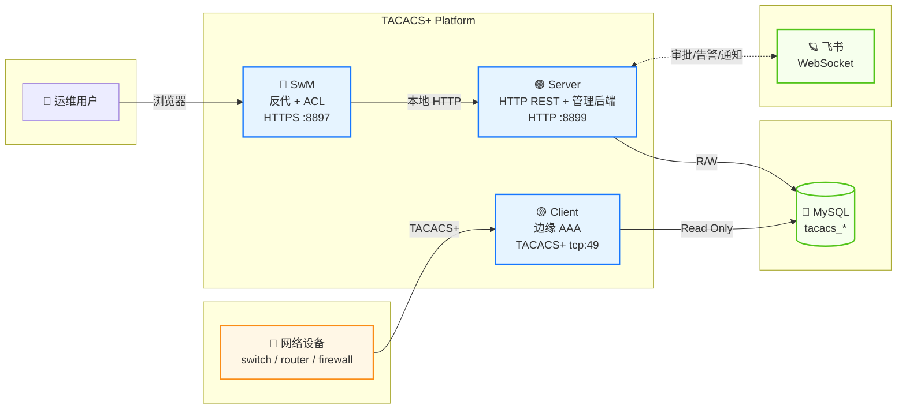
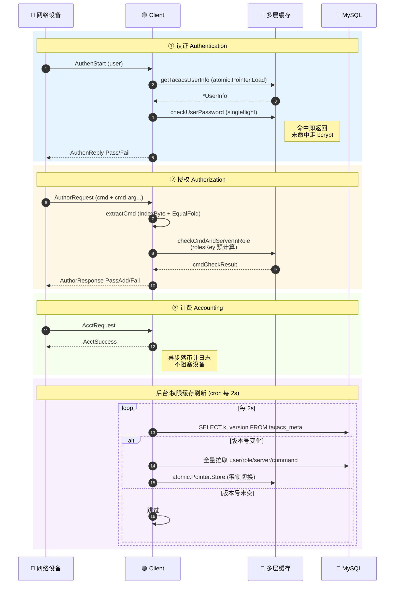
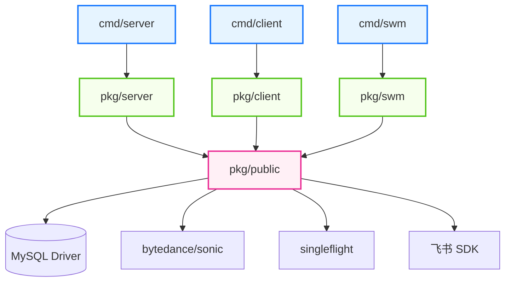
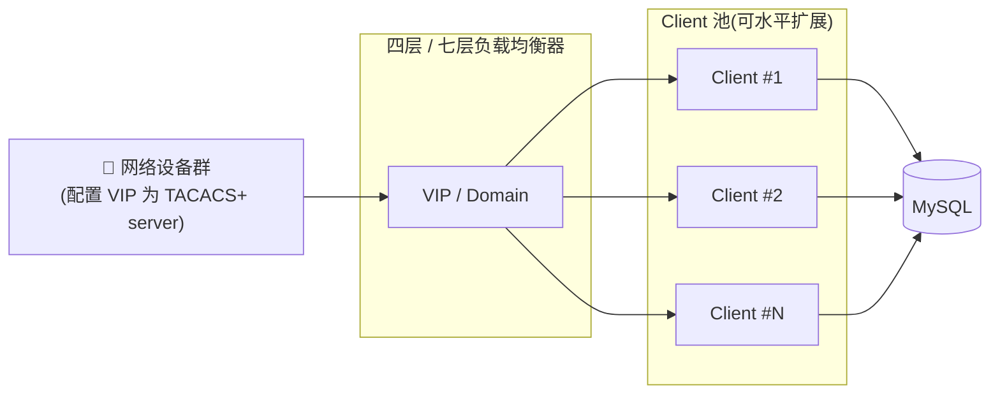
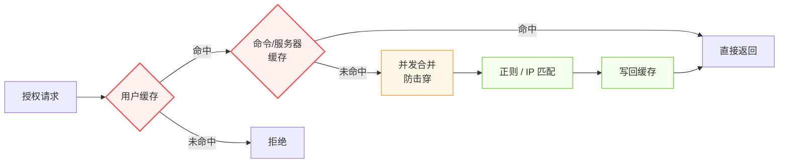

<div align="center">

# TACACS+ Authentication System

**企业级 TACACS+ 鉴权与权限管理一体化平台**

*Enterprise-grade TACACS+ AAA platform with built-in management portal & ACL*

[](https://go.dev/)
[](https://datatracker.ietf.org/doc/rfc8907/)
[](https://www.mysql.com/)
[](#-构建)
[](#-license)

</div>

---

## 📑 目录

- [✨ 核心特性](#-核心特性)
- [🏗️ 系统架构](#️-系统架构)
- [🔄 协议流程](#-协议流程)
- [⚠️ 部署前安全须知](#️-部署前安全须知)
- [🚀 快速开始](#-快速开始)
  - [① 环境准备](#-环境准备-prerequisites)
  - [② 数据库](#-数据库)
  - [③ 配置文件](#-配置文件)
  - [④ 构建](#-构建)
  - [⑤ 启动服务](#-启动服务)
  - [⑥ 初始化第一个管理员](#-初始化第一个管理员)
- [🔐 管理员账号变更](#-管理员账号变更)
- [🛟 值班白名单管控](#-值班白名单管控)
- [📦 目录结构](#-目录结构)
- [⚖️ 负载均衡](#️-负载均衡)
- [⚡ 性能与缓存设计](#-性能与缓存设计)
- [🔌 端口与协议](#-端口与协议)
- [📜 License](#-license)

---

## ✨ 核心特性


| 维度                 | 能力                                                                                   |
| -------------------- | -------------------------------------------------------------------------------------- |
| 🔐**协议合规**       | 完整实现 TACACS+ (RFC 8907) Authentication / Authorization / Accounting                |
| 🌐**一体化前端**     | SwM 反向代理 + ACL 鉴权层,统一入口 HTTPS :8897                                         |
| ⚡**高性能缓存**     | 用户/密码/命令三层缓存,授权热路径毫秒级响应                                            |
| 🔄**2 秒级权限同步** | 数据库触发器驱动版本号,权限变更最慢 2 秒生效                                           |
| 🛡️**密码安全**     | bcrypt 哈希存储,密码字段永不明文外泄                                                   |
| 📊**飞书集成**(可选) | 卡片消息 + 应用内/短信/电话加急,审批/告警/通知一站式;不接入也能在 SwM 前端走完整审批流 |
| 🧰**运维友好**       | 命令模板 / 角色模板 / 服务器模板 / 值班白名单全部 Web 化管理                           |
| 🔧**水平扩展**       | Client 边缘节点无状态,四层/七层 LB 即可扩容                                            |

---

## 🏗️ 系统架构



**三个二进制各司其职**:

- **SwM** — 浏览器入口、HTTPS 卸载、CSRF/ACL 中间件、签名校验,后端只暴露给 SwM 这一条链路。
- **Server** — 业务逻辑与持久化,所有用户/角色/命令/服务器模板/审批/值班的 CRUD 都在这里;同时也是飞书消息发出方。
- **Client** — 部署在每个边缘节点,直接和网络设备的 TACACS+ 客户端对话,只读 DB,本地维护多层缓存。

---

## 🔄 协议流程



---

## ⚠️ 部署前安全须知

> 在拉起服务之前**务必**阅读本节。本节描述的部署前提是系统安全模型的基石,不满足会直接导致**未授权访问**。

**🔒 安全边界设计**

本平台的访问控制模型是分层的:

- **SwM(8897)** — 唯一的浏览器入口,负责身份认证、CSRF、签名生成,所有管理员/普通用户 ACL **全部在此完成**
- **Server(8899)** — 业务后端,通过 HMAC 签名校验请求来自持有 `swm_auth.shared_secret` 的调用方。签名 base 已经把 `X-SwM-User` / `X-SwM-Is-Admin` 头纳入计算,因此**第三方无法在网络中篡改这两个头**;但后端**不验证"是谁把这两个头填上去的"** —— 持密钥的调用方(= SwM 本体)可以为任意 user / isAdmin 组合算出合法签名

这意味着:**任何能直接访问 8899 的客户端,只要持有 `swm_auth.shared_secret`,就可以伪造任意身份调用任意接口,包括管理员独占接口。**

**🛡️ 强制部署约束**


| # | 约束                                                                                                       | 不满足的后果                                                |
| -: | ---------------------------------------------------------------------------------------------------------- | ----------------------------------------------------------- |
| 1 | **Server 监听地址必须是 `127.0.0.1:8899` 或仅对 SwM 主机开放的内网 IP**,**严禁**暴露到公网或办公网         | 任何持密钥者可越权操作                                      |
| 2 | **`swm_auth.shared_secret` 必须使用强随机值**(建议 `openssl rand -base64 48`),且 SwM 与 Server 严格一致    | 弱密钥可被爆破,等价于 #1 失守                               |
| 3 | **`swm_auth.enforce: true` 生产环境必须开启**                                                              | 关闭后任何匿名请求都能直达 Server                           |
| 4 | **生产环境必须走 HTTPS**:要么填 `cfg_swm.yaml` 的 `cert_file` / `key_file` 让 swm 自跑 HTTPS,要么在前面挂 nginx/ALB 反代终结 TLS(反代场景下两个字段可留空,swm 降级明文 HTTP)。HTTP 模式仅在 **本机用 `http://localhost` / `127.0.0.1` 直连开发**时勉强能用(浏览器把回环视为 secure context),**任何用 LAN IP / 域名访问 HTTP 的场景都会因 Secure cookie 不被接受而登录失败** | 中间人可截获 session cookie;且非回环 HTTP 访问下 cookie 被浏览器丢弃,登录走不通 |
| 5 | **数据库账号严格区分读写**:Client 用只读账号,Server 用读写账号                                             | 边缘节点失陷可改库                                          |
| 6 | **跨机部署务必显式设置 `swm_auth.allowed_cidrs`**(默认仅放行 `127.0.0.1/32` + `::1/128`)                   | 配错=同机白名单挡掉所有真实请求;不配=对外暴露时 #1 防线裸奔 |

> **关于 #6 的兜底机制**:Server 在签名校验之前先按源 IP 兜底拒绝。默认配置(`allowed_cidrs` 留空)只放行本机回环,适合「SwM 与 Server 同机部署」的开箱即用场景。跨机部署需在 `cfg_server.yaml` 的 `swm_auth.allowed_cidrs` 显式列出 SwM 主机的 IP 或网段(CIDR 格式,单 IP 必须带 `/32` 或 `/128` 后缀)。

**🚪 推荐网络拓扑**

```
公网 / 办公网
     │
     ▼
   ┌─────────────┐
   │ SwM :8897   │  (HTTPS, 公开)
   └──────┬──────┘
          │ 127.0.0.1 / 内网 only
          ▼
   ┌─────────────┐
   │ Server:8899 │  (HTTP, 内网封闭)
   └──────┬──────┘
          ▼
       MySQL
```

> 同主机部署最简单:Server 与 SwM 装一台机器,Server 配 `http: "127.0.0.1:8899"` 即可。此场景下 `swm_auth.allowed_cidrs` 留空也安全 —— Server 自带的 IP 白名单默认仅放行 loopback,等价于对外彻底封闭。

---

## 🚀 快速开始

### ① 环境准备 *Prerequisites*


| 依赖      | 版本要求                    | 说明                                                     |
| --------- | --------------------------- | -------------------------------------------------------- |
| **Go**    | `>= 1.26`                   | 编译 server/client/swm 三个二进制                        |
| **MySQL** | `>= 5.7` 或 `8.0`           | InnoDB 引擎 (用于触发器 + 行锁)                          |
| **OS**    | Linux / macOS               | 支持 amd64、arm64 架构                                   |
| **网络**  | TCP 49 / 8383 / 8897 / 8899 | 分别对应 TACACS+ / Client HTTP / SwM HTTPS / Server HTTP |

**环境变量**


| 变量      | 说明                                                 | 默认值 |
| --------- | ---------------------------------------------------- | ------ |
| `APP_ENV` | 运行环境,设为`prod` 则连接生产 DB 和 Apollo 生产集群 | `test` |

使用 `deploy.sh` 启动时直接传入即可：

```bash
# 测试环境(默认)
./scripts/deploy.sh start server

# 生产环境
APP_ENV=prod ./scripts/deploy.sh start server
```

手动启动时需自行设置：

```bash
# Linux / macOS (bash / zsh)
export APP_ENV=prod
./build/<os>_<arch>/server -c cfg.yaml

# 或单次生效
APP_ENV=prod ./build/<os>_<arch>/server -c cfg.yaml
```

### ② 数据库

> 默认使用 MySQL,其他 RDBMS 暂未适配。

**Step 2.1 — 创建库**

```bash
mysql -u <user> -p
```

```sql
CREATE DATABASE IF NOT EXISTS <db_name>
    DEFAULT CHARSET = utf8mb4
    COLLATE = utf8mb4_unicode_ci;
```

请把 **用户名 / 密码 / 库名** 记录下来,后面写进配置文件。

**Step 2.2 — 业务表**

```bash
DB=<db_name>
USER=<user>

mysql -u $USER -p $DB < static/sql/tacacs_admin.sql
mysql -u $USER -p $DB < static/sql/tacacs_approval.sql
mysql -u $USER -p $DB < static/sql/tacacs_command_template.sql
mysql -u $USER -p $DB < static/sql/tacacs_role_template.sql
mysql -u $USER -p $DB < static/sql/tacacs_server_template.sql
mysql -u $USER -p $DB < static/sql/tacacs_user.sql
mysql -u $USER -p $DB < static/sql/tacacs_on_duty.sql
mysql -u $USER -p $DB < static/sql/tacacs_on_duty_white_list.sql
```

每个表的语义:


| 表                          | 作用                             |
| --------------------------- | -------------------------------- |
| `tacacs_admin`              | 平台管理员账号                   |
| `tacacs_user`               | 受 TACACS+ 鉴权的最终用户        |
| `tacacs_role_template`      | 角色模板:命令集 + 服务器集的组合 |
| `tacacs_command_template`   | 可执行命令的正则集合             |
| `tacacs_server_template`    | 可登录服务器(IP / CIDR)集合      |
| `tacacs_approval`           | 临时权限申请与审批工单           |
| `tacacs_on_duty`            | 值班人员(免角色检查)             |
| `tacacs_on_duty_white_list` | 值班权限白名单                   |

**Step 2.3 — 缓存版本号触发器**

```bash
mysql -u $USER -p $DB < static/sql/tacacs_meta.sql
```

> 💡 **为什么需要这一步?**
> Client 每 2 秒轮询一次,判断"权限数据是否有变更",依据是 `tacacs_meta` 表里的版本号。`tacacs_meta.sql` 会建表 + 18 个触发器(用户/角色/服务器/命令/值班/审批 × 增删改),把传统依赖 `information_schema.UPDATE_TIME` 的 NULL / 秒级精度问题彻底绕开。
>
> 脚本**幂等**,可重复执行;执行账号需要 `CREATE` + `TRIGGER` 权限。

### ③ 配置文件

**Step 3.1 — 拷贝模板并填空**

```bash
cp static/cfg/cfg_client_example.yaml cmd/client/cfg.yaml
cp static/cfg/cfg_server_example.yaml cmd/server/cfg.yaml
cp static/cfg/cfg_swm_example.yaml    cmd/swm/cfg.yaml
```

按各 yaml 内的注释填写数据库连接、监听地址、共享密钥等。三份文件的关系:

```
cfg_server.yaml   ← 数据库 + 飞书 + 监听 8899
cfg_client.yaml   ← 数据库(只读) + TACACS 共享密钥 + 监听 49(TACACS+) + 8383(HTTP /health)
cfg_swm.yaml      ← TLS 证书(可选,留空降级 HTTP)+ 反代目标 + 监听 8897
```

**Step 3.2 — Apollo 配置中心(可选,强烈推荐)**

> 💡 **为什么推荐?** 接入 Apollo 后可以在不重启服务的情况下:动态切换 debug 日志模式、实时更新值班人员列表、热更新服务配置。

如果使用 Apollo 管理配置,需要准备 Apollo 连接信息:

```bash
cp static/cfg/apollo_example.yaml apollo.yaml
# 编辑 apollo.yaml,填写 Apollo 服务端地址和密钥
```

也可以通过环境变量配置(优先级高于文件):

```bash
export APOLLO_APP_ID="your-app-id"
export APOLLO_CLUSTER="default"
export APOLLO_IP="http://your-apollo-server:8080"
export APOLLO_NAMESPACE="application"
export APOLLO_SECRET="your-secret"
```

> 💡 **配置加载优先级**: Apollo > 本地文件(`-c`) > 报错。即使指定了 `-c cfg.yaml`,只要 Apollo 可用就优先使用 Apollo 的配置;Apollo 不可用时自动回退到本地文件。不使用 Apollo 时,Apollo 初始化失败不影响本地配置加载。
>
> Cluster 通过 `apollo.yaml` 的 `cluster` 字段或环境变量 `APOLLO_CLUSTER` 指定,默认值为 `default`。

**Apollo 中的 Key 与配置内容**

所有配置均从 Apollo `application` 命名空间读取,Key 列表如下:


| 用途        | Apollo Key | Value 格式 | 说明                                                            |
| ----------- | ---------- | ---------- | --------------------------------------------------------------- |
| Server 配置 | `server`   | 完整 YAML  | 内容同`static/cfg/cfg_server_example.yaml`                      |
| Client 配置 | `client`   | 完整 YAML  | 内容同`static/cfg/cfg_client_example.yaml`                      |
| SwM 配置    | `swm`      | 完整 YAML  | 内容同`static/cfg/cfg_swm_example.yaml`                         |
| 值班人员    | `on_duty`  | JSON       | `{"on_duty":["user1","user2"]}`,动态设置值班人员,修改后实时生效 |
| Debug 模式  | `debug`    | 字符串     | `true` 或 `false`,开启后输出详细日志,修改后实时生效             |

> ⚠️ 前三个 Key 的 Value 是 **完整的 YAML 配置内容**,不是文件路径。在 Apollo 控制台创建时,将示例模板的内容直接粘贴为 Value。

以下是各 Key 的配置示例:

<details>
<summary><b>Key: <code>server</code></b> — 管理后端配置</summary>

```yaml
http: "0.0.0.0:8899"
manager: ""                        # 服务负责人飞书用户ID，panic 时通知
log_file_path: "./logs/"

swm_auth:
  enforce: true
  shared_secret_env: "SWM_SHARED_KEY"
  shared_secret: "your-shared-secret"
  max_skew_seconds: 300
  allowed_origin: ""
  # 源 IP 白名单(CIDR 格式,单 IP 必须带 /32 或 /128 后缀)。
  # 留空时默认仅放行 127.0.0.1/32 和 ::1/128(同机部署开箱即用)。
  # 跨机部署务必显式声明,例:
  # allowed_cidrs:
  #   - "10.0.0.5/32"     # SwM 所在主机
  #   - "10.0.1.0/24"     # 同网段所有 SwM 实例
  allowed_cidrs: []

feishu:
  enabled: true
  app_id_env: "FEISHU_APP_ID"
  app_secret_env: "FEISHU_APP_SECRET"

database:
  prod:
    write:
      username: "user_write"
      password: "password"
      address: "127.0.0.1:3306"
      table: "tacacs"
    read:
      username: "user_read"
      password: "password"
      address: "127.0.0.1:3306"
      table: "tacacs"
```

</details>

<details>
<summary><b>Key: <code>client</code></b> — 边缘 AAA 节点配置</summary>

```yaml
http: "0.0.0.0:8383"
manager: ""                        # 服务负责人飞书用户ID，panic 时通知
log_file_path: "./logs/"

# client 只装载只读连接,DbWrite 维持 nil;无需也禁止在 client 配置里持有 write 账号
database:
  prod:
    read:
      username: "user_read"
      password: "password"
      address: "127.0.0.1:3306"
      table: "tacacs"

tacPlus:
  ip: "0.0.0.0"
  port: "49"
  shareKey: "your-tacacs-shared-key"
  dscp: "0"
```

</details>

<details>
<summary><b>Key: <code>swm</code></b> — 前端反代配置</summary>

```yaml
http: "0.0.0.0:8897"
manager: ""                        # 服务负责人飞书用户ID，panic 时通知
tacacs_manager_url: "http://localhost:8899"
session_time_out: 10
log_file_path: "./logs/"
cert_file: ""                      # 两个都空 → HTTP (仅反代后端 / http://localhost 自连)
key_file: ""                       # 两个都填 → HTTPS;只填一个启动报错
swm_shared_secret_env: "SWM_SHARED_KEY"
swm_shared_secret_file: ""
swm_shared_secret: "your-shared-secret"

feishu:
  enabled: true
  app_id_env: "FEISHU_APP_ID"
  app_secret_env: "FEISHU_APP_SECRET"
```

</details>

<details>
<summary><b>Key: <code>on_duty</code></b> — 值班人员(JSON)</summary>

```json
{
  "on_duty": ["tacacs_user1", "tacacs_user2"]
}
```

Server 从该 Key 读取值班人员列表,与 `tacacs_on_duty_white_list` 表取交集后写入 `tacacs_on_duty` 表。值班用户在认证时跳过角色检查。修改 Apollo 后实时生效,无需重启。

</details>

<details>
<summary><b>Key: <code>debug</code></b> — Debug 模式开关</summary>

```
true
```

设为 `true` 开启 debug 日志,`false` 关闭。通过 Apollo 变更监听实时生效,无需重启。

</details>

> ⚠️ **注意**: `server` 的 `swm_auth.shared_secret` 和 `swm` 的 `swm_shared_secret` 必须保持一致,否则 SwM 到 Server 的请求签名校验会失败。

> 💡 **飞书是可选项,不是必填**:`feishu.enabled: false` 或干脆不接入飞书时,审批/通知**完全可以在 SwM 前端走完**(申请单 / 审批单 / 历史记录都在管理后台里)。飞书带来的只是"卡片消息 + 应用内/短信/电话加急"的提醒锦上添花,**不影响任何业务能力**。`manager` 字段同理 —— 留空就是不发 panic 飞书告警,进程崩溃日志依然落 `{server,client,swm}_app.log`。

### ④ 构建

**构建当前平台**

```bash
make build
```

三个二进制输出到 `build/<os>_<arch>/` 目录:

```
build/
└── linux_amd64/
    ├── server
    ├── client
    └── swm
```

**单独构建**

```bash
make build-server
make build-client
make build-swm
```

**交叉编译**

```bash
# Linux ARM64
GOOS=linux GOARCH=arm64 make build

# macOS Intel
GOOS=darwin GOARCH=amd64 make build
```

**全平台构建**

一次性构建所有支持的 OS/ARCH 组合:

```bash
make release
```

支持的平台:


| OS       | ARCH            |
| -------- | --------------- |
| `linux`  | `amd64` `arm64` |
| `darwin` | `amd64` `arm64` |

> 其他平台（Windows、FreeBSD 等）未做支持和测试,建议使用 Linux 或 macOS。

### ⑤ 启动服务

> 启动顺序:**Server → Client → SwM**。SwM 依赖 Server 提供后端 API。

**方式一:使用部署脚本(推荐)**

```bash
# 测试环境启动（默认 APP_ENV=test）
./scripts/deploy.sh start server
./scripts/deploy.sh start client
./scripts/deploy.sh start swm

# 生产环境启动
APP_ENV=prod ./scripts/deploy.sh start server
APP_ENV=prod ./scripts/deploy.sh start client
APP_ENV=prod ./scripts/deploy.sh start swm

# 查看状态
./scripts/deploy.sh status server

# 优雅停止
./scripts/deploy.sh stop server

# 重启
./scripts/deploy.sh restart server
```

指定配置文件:

```bash
CFG_FILE=/etc/tacacs/server.yaml ./scripts/deploy.sh start server
APP_ENV=prod CFG_FILE=/etc/tacacs/server.yaml ./scripts/deploy.sh start server
```

**方式二:手动启动**

```bash
./build/<os>_<arch>/server -c cfg_server.yaml
./build/<os>_<arch>/client -c cfg_client.yaml
./build/<os>_<arch>/swm    -c cfg_swm.yaml
```

启动成功后访问:

🌐 **[https://localhost:8897](https://localhost:8897)**

### ⑥ 初始化第一个管理员

平台的管理员账号通过 `tacacs_admin` 表登记。**首次部署后没有任何管理员**,需要手动建一个。后续如何变更管理员见下文 [🔐 管理员账号变更](#-管理员账号变更)。

**Step 6.1** — 访问 SwM,在登录页**注册**一个普通用户(任意用户名,例如 `admin`):

```
🌐 https://localhost:8897  →  「注册」标签页  →  填写用户名 / 邮箱 / 电话 / 密码  →  提交
```

**Step 6.2** — 把这个用户提升为管理员:

```sql
mysql -u <user> -p <db_name>

INSERT INTO tacacs_admin (`user`) VALUES ('admin');   -- 用你刚注册的用户名
```

**Step 6.3** — 退出后重新登录,即获得管理员权限(右上角会出现"管理员"徽章)。

> 🔁 **后续撤销 / 交接 / 新增其他管理员** 同样**只能走 SQL** —— 平台刻意不提供前端入口和 HTTP 接口,详见下一节 [🔐 管理员账号变更](#-管理员账号变更)(含 `DELETE` / 事务交接示例与生效时机)。

---

## 🔐 管理员账号变更

管理员权限非常高 —— 可以修改任意用户的密码、为任意人授权任意角色、关闭任意工单、查询全量审计日志。为了把"扩散"风险压到最低,**平台刻意不提供管理员变更的前端入口和 HTTP 接口**:


| 层                  | 状态                                                                                                  |
| ------------------- | ----------------------------------------------------------------------------------------------------- |
| **SwM 前端**        | 没有「申请管理员 / 授予管理员 / 撤销管理员」按钮,任何角色都看不到此类入口                             |
| **Server REST API** | 只暴露`GET /tacacs/user/get-admin`(查询当前管理员列表),**没有**任何 `create / update / delete` 类接口 |
| **唯一变更途径**    | 拥有数据库写权限的 DBA 直接 SQL 操作`tacacs_admin` 表                                                 |

这意味着即使现任管理员账号被攻陷,攻击者也**无法横向新增更多管理员**,边界天然控制在 DBA 这一层。代价是变更不方便,收益是平台不存在「权限内提权」路径。

### 常用 SQL

```sql
mysql -u <dba_user> -p <db_name>

-- ① 查看当前所有管理员
SELECT id, `user` FROM tacacs_admin ORDER BY id;

-- ② 新增管理员(被加的用户必须已经在 SwM 注册过,即 tacacs_user 表有记录)
INSERT INTO tacacs_admin (`user`) VALUES ('alice');

-- ③ 撤销管理员(只删管理员资格,不影响其普通用户身份和密码)
DELETE FROM tacacs_admin WHERE `user` = 'alice';

-- ④ 交接(一条事务里完成新老交替,避免空窗)
START TRANSACTION;
INSERT INTO tacacs_admin (`user`) VALUES ('new_admin');
DELETE FROM tacacs_admin WHERE `user` = 'old_admin';
COMMIT;
```

### 生效时机

- SwM 在用户登录态构造时通过 `getAdminUsers()` 拉取一次管理员列表,**内存缓存 30 秒**
- 所以 SQL 改完后:
  - **被新增的管理员**:重新登录立即生效(右上角出现「管理员」徽章)
  - **被撤销的管理员**:已登录会话在 ≤ 30 秒内自动失去管理员视图;立即生效的最快方式是让该用户 logout

### 注意事项

- `tacacs_admin` 没有外键约束,误删可立刻 `INSERT` 回去
- 管理员的密码、邮箱、电话等存在 `tacacs_user` 表,撤销管理员**不会**删除这些 —— 用户仍可作为普通用户登录
- 变更建议留 DBA 审计记录(`mysql -e`、`binlog`、或外部审批流),平台本身**不会**把这类 DDL 写进 `server_audit.log` / `swm_audit.log`

---

## 🛟 值班白名单管控

值班用户(`tacacs_on_duty`)在认证时**跳过角色检查**,等价于"临时全权",其敏感度仅次于管理员。为防止外部系统(Apollo / CMDB / 排班工具)被攻陷或误操作导致权限被任意拉起,平台对值班名单采用**双因子写入**模型:

```
实际生效的值班用户 = 外部系统下发 ∩ DBA 维护的白名单
                  └─── Apollo on_duty Key ──┘   └── tacacs_on_duty_white_list 表 ──┘
                       (便捷,易变更)             (受控,只允许 DBA 改)
```

任何账号能登上"值班"必须**同时满足**两个前置条件:外部源把它列入了排班,**且** DBA 已经把它写进白名单。两者缺一不可。这样一来:

- 外部排班系统失陷 / 配置被误改 → 攻击者最多把已经在白名单里的人**调进调出**,**无法**把新账号擢升为值班
- 白名单是平台对外部值班源的"准入闸门",**白名单之外的账号在数据库里永远不会出现在 `tacacs_on_duty`**
- 白名单本身只在数据库里维护,没有任何 HTTP / 前端入口,等同于管理员变更走 DBA 通道


| 层                  | 状态                                                                      |
| ------------------- | ------------------------------------------------------------------------- |
| **SwM 前端**        | 没有「申请值班资格 / 加入白名单」按钮,任何角色都看不到此类入口            |
| **Server REST API** | 不暴露任何`tacacs_on_duty_white_list` 的 CRUD 接口                        |
| **外部值班源**      | 通过 Apollo`on_duty` Key 下发(便捷,可随时调整),但**只在白名单交集内生效** |
| **唯一变更途径**    | 拥有数据库写权限的 DBA 直接 SQL 操作`tacacs_on_duty_white_list` 表        |

### 常用 SQL

```sql
mysql -u <dba_user> -p <db_name>

-- ① 查看当前白名单
SELECT `user` FROM tacacs_on_duty_white_list ORDER BY `user`;

-- ② 查看当前实际生效的值班用户(已经过白名单交集过滤)
SELECT `user` FROM tacacs_on_duty ORDER BY `user`;

-- ③ 把一个用户加入白名单(必须先在 tacacs_user 表注册过)
INSERT INTO tacacs_on_duty_white_list (`user`) VALUES ('alice');

-- ④ 从白名单移除(对方下一轮 Apollo on_duty 同步就会被自动剔出 tacacs_on_duty)
DELETE FROM tacacs_on_duty_white_list WHERE `user` = 'alice';

-- ⑤ 批量替换白名单(全量重写,小心使用,建议放事务里)
START TRANSACTION;
DELETE FROM tacacs_on_duty_white_list;
INSERT INTO tacacs_on_duty_white_list (`user`) VALUES ('alice'), ('bob'), ('carol');
COMMIT;
```

### 生效时机

- **白名单本身改完不会立刻刷 `tacacs_on_duty`**:Server 监听的是 Apollo `on_duty` 的变更事件,不监听 `tacacs_on_duty_white_list`。下一次 Apollo `on_duty` 推送(或任何触发 `UpdateOnDutyUsers` 的事件)时才会重新计算交集
- 想**立刻生效**有两种办法:
  1. 在 Apollo 把 `on_duty` Key 原样保存一次,触发一次变更回调
  2. 手动 SQL 同步一次 `tacacs_on_duty`(`DELETE FROM tacacs_on_duty WHERE user = 'alice'`)
- `tacacs_on_duty` 写完后,Client 的本地缓存最慢 **2 秒** 重建(版本号驱动同步),设备侧就能感受到

### 注意事项

- 白名单条目必须是 `tacacs_user` 表里已经存在的用户名,否则交集后等于没加
- 移除一个人的"管理员"和"值班资格"是**两件事**:撤销管理员只 `DELETE FROM tacacs_admin`,撤销值班资格要 `DELETE FROM tacacs_on_duty_white_list`(并视情况立刻同步一次 `tacacs_on_duty`)
- 白名单变更同样**不会**写 `server_audit.log`,建议靠 `mysql -e` / `binlog` / 外部审批流留痕

---

## 📦 目录结构

```
.
├── cmd/
│   ├── server/   # tacacs server 入口(HTTP REST + 管理后端)
│   ├── client/   # tacacs client 入口(边缘 AAA)
│   └── swm/      # 前端 + 反代 + ACL 入口(原 SwM 项目)
├── pkg/
│   ├── server/   # server 端代码
│   ├── client/   # client 端代码
│   ├── swm/      # 原 SwM 内部代码(http / cfg / log / g)
│   └── public/   # server / client / swm 共享代码
├── scripts/
│   └── deploy.sh # 服务管理脚本(start/stop/restart/status)
├── static/
│   ├── cfg/      # 配置文件模板
│   └── sql/      # 数据库 schema + 触发器
└── Makefile      # 构建入口(make build / make release / make clean)
```

**模块依赖关系**:



---

## ⚖️ 负载均衡



**部署步骤**:

1. **整理 Client 节点 IP 列表**

   平台本身**没有**提供"列出所有 Client"的接口 —— 由于 Client 完全无状态、只读 DB,部署位置(主机 / Pod / 边缘节点)由你自己控制。把当初部署 Client 的那批 IP 整理出来即可,常用做法:

   - 在 CMDB / Ansible inventory / K8s Service Endpoints 里查
   - 或在每个 Client 节点上 `curl -sf http://127.0.0.1:8383/health` 探活,筛出存活的那批
2. **配置负载器**

   - 后端 RS:上一步整理出的所有 Client IP(默认 TACACS+ 端口 49)
   - 前端 VIP / 域名:配置到所有需要 TACACS+ 鉴权的网络设备上

Client 之间**完全无状态**,只读 DB + 本地缓存,可任意横向扩展。

---

## ⚡ 性能与缓存设计

Client 的授权热路径已经做过专门优化:



**核心机制**:

- 🚀 **三层本地缓存** — 用户信息、密码验证结果、命令授权结果分别缓存,读操作零锁,刷新时整体原子切换。
- 🛡️ **并发请求合并** — 同一用户/命令的并发缓存未命中自动合并为单次计算,避免击穿（尤其是 bcrypt 密码验证场景）。
- 🔁 **版本号驱动同步** — 数据库触发器自动维护版本号,Client 每 2 秒轮询,版本变化时全量重建缓存,**最慢 2 秒生效新权限**。
- 🔍 **角色 Key 预计算** — 用户角色组合 key 在缓存装载时一次性算好,授权请求时直接查找,无需每次重新计算。
- ⏱️ **小时级兜底** — 即便触发器异常,每小时强制全量重建一次,确保缓存最终一致。

---

## 🔌 端口与协议


|     端口 | 协议          | 进程   | 暴露范围                                                |
| -------: | ------------- | ------ | ------------------------------------------------------- |
|   **49** | TACACS+ (TCP) | Client | 网络设备 → Client                                      |
| **8383** | HTTP          | Client | 运维探活/健康检查 (仅`/health`,全局限速 2 QPS,建议内网) |
| **8897** | HTTPS         | SwM    | 浏览器 → SwM                                           |
| **8899** | HTTP          | Server | 仅 SwM → Server (建议绑 127.0.0.1)                     |

DSCP 标记可在 Client 配置文件里指定(`tacPlus.dscp`),用于运营商网络 QoS。

---

## 📜 License

This project is licensed under the [GNU General Public License v3.0](LICENSE).

---

<div align="center">

**Made with ❤️ for network operations**

</div>
